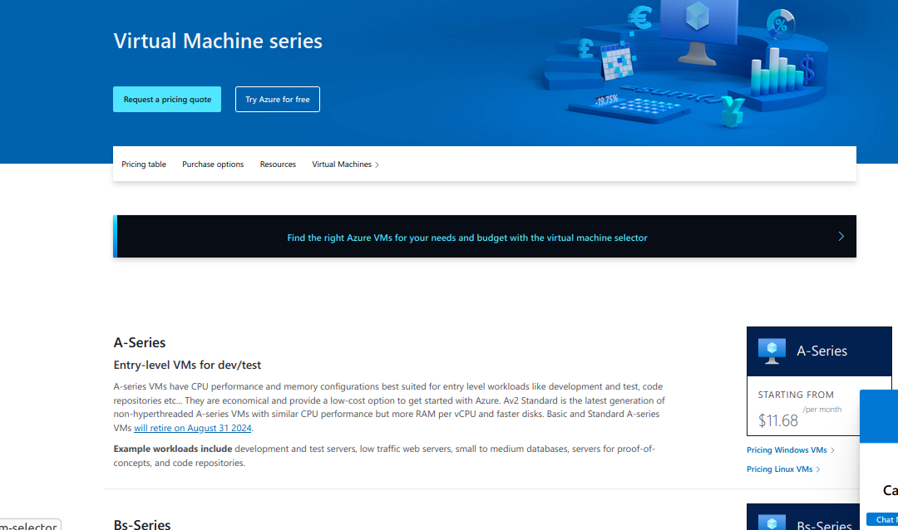
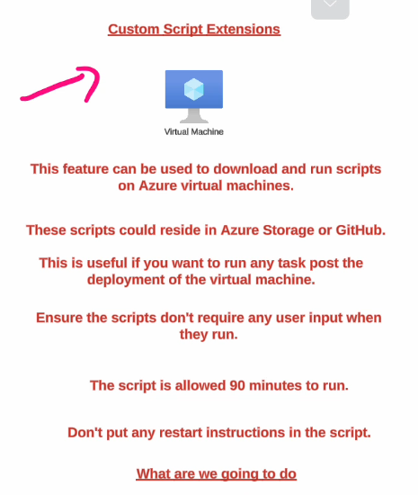
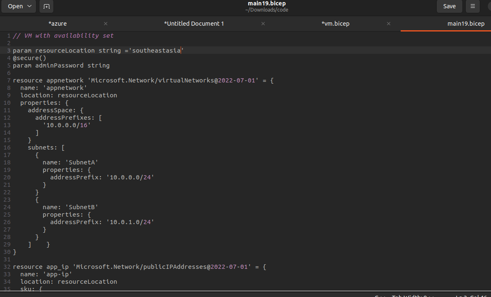
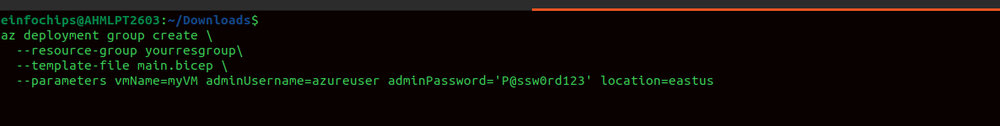

**Microsoft Azure**

**Creating an Ubuntu Virtual Machine in Azure**

**Connecting to that VM using SSH**

**ssh -i \<private-key-file-path\> azureuser@publicip**

Creating a security inbound rule allowing HTTP to access nginx page

Ngnix installed successfully

Virtual Machine

each VM has its own image & we can find new images from marketplace

Azure VM has different series

Like A series - **Entry-level VMs for dev/test**

Bs Series - **Economical burstable VMs**

**D series - General purpose compute**

**Azure VM Disks**

**IOPS: (Input/Output per second)**

how many read/write operations a system can perform in one second.

Like using data base which needs high read and write operations

**Throughput**:

amount of data transferred per second.

Eg. To Copy large videos & files

**Snapshot:**

A **snapshot** in Azure is a **point-in-time, full, read-only copy** of
a managed disk.

Create a snapshot and attach it to new VM

We can create a snapshot and then create a disk attach to an existing
disk

Generally Virtual network,Network interfaces Network Security Groups are
free of cost in azure

Public ip, Disk etc.. price depends on time.

**AZure Key-vault Service**

**Custom Script Extensions**

**We can also use custom data**

**Boot diagnostics is a feature in Azure Virtual Machines (VMs) that
helps you troubleshoot VM startup issues.**

**When you enable it, Azure captures:**

1.  **Console output (text output during boot)\
    > **

2.  **Screenshot of the VM's desktop (for Windows) or console (for
    > Linux)\
    > **

**This helps you see what's happening inside the VM when it starts up
--- useful if the VM is stuck, unresponsive, or fails to boot.**

**Run Commad:**

**Run Command in Azure lets you run scripts or commands inside an Azure
VM directly from the Azure Portal, CLI, or PowerShell --- without
needing to log in via RDP (Windows) or SSH (Linux).**

**Availability Sets**

**Availability Set → Protects against failures within one datacenter
(rack-level).\
**

**Availability Zone → Protects against failures across multiple
datacenters in a region.**

**Availability Set = a grouping feature that distributes your VMs across
multiple fault domains and update domains, ensuring higher availability
within a single Azure region datacenter.**

**AZURE Scale set**

**An Azure Virtual Machine Scale Set (VMSS) is a service that lets you
deploy and manage a set of identical VMs that can automatically scale
in/out based on demand or a defined schedule.**

**Think of it as an auto-scaling group of VMs behind a load balancer.**

-   **Automatically increase capacity when demand is high.**

-   **Automatically decrease capacity when demand is low (saving
    > cost).**

-   **Ensure high availability (VMs are spread across fault/update
    > domains or zones).**

**Virtual Machine Images**

**We can create Images from an existing VM. It is the complete blueprint
of the VM which we can use to launch another VM which has the same
functionality.**

**Proximity Placement groups**

**Proximity Placement Group (PPG) is an Azure logical grouping that
ensures your Virtual Machines (VMs) are physically located close to each
other within the same datacenter.**

**Sometimes Apps need least latency ,High-Performance Computing (HPC),
n-memory databases (like Redis, SAP HANA),**

**\
**

**Azure Webapp**

**An Azure Web App is a Platform-as-a-Service (PaaS) offering from
Microsoft Azure that allows you to host, build, and scale web
applications without managing the underlying infrastructure.**

**like .NET, Java, Python, PHP, Node.js, Ruby, etc.**

**Free plan has only 60/day of webapp**

**Azure App Service (Web Apps), Deployment Slots are like having
multiple live environments (instances) for your application within the
same App Service.**

**They allow you to safely deploy and test changes without affecting
your production app.**

**Autoscaling in azure webapp**

**Azure Container Registry**

Azure **Container Registry (ACR)** is a **managed, private Docker
registry service** provided by Microsoft Azure. It allows you to **store
and manage container images and artifacts** (like Helm charts, OCI
artifacts) that you use in your containerized applications.

Publishing an docker based image on AZure Container Registry

Azure Container Instances

**ACI** is a **serverless container service** on Azure.

It lets you **run containers directly in the cloud** without having to
manage virtual machines (VMs) or Kubernetes clusters.

You just **provide the container image** (e.g., from Docker Hub or Azure
Container Registry), and Azure runs it for you.

Multiple Container Instances are container groups

A **Container Group** is the **top-level resource in Azure Container
Instances**.

It is similar to a **Pod in Kubernetes**.

A container group can contain **one or more containers** that:

-   Share the **same host machine\
    > **

-   Share the **same network, IP address, and ports\
    > **

-   Share **data volumes**

**Private Image Storage** → Store Docker/OCI images securely in your
Azure subscription.

**Integration with Azure Services** → Works with **AKS (Azure Kubernetes
Service)**, **App Service**, **Container Instances**, etc.

**Azure Container Apps** is a **fully managed, serverless container
service** that lets you run containerized applications **without
managing infrastructure like VMs, Kubernetes, or orchestrators**.

**Virtual Network**

Creating a VNet

**Network Interface**

**Azure**, a **Network Interface (NIC or Network Interface Card)** is a
resource that allows an **Azure Virtual Machine (VM)** to connect to a
**Virtual Network (VNet)**.

## **Azure Bastion**

-   **Purpose: Secure administrative access (RDP/SSH) to Azure VMs
    > without exposing them to the internet means without public ip\
    > **

-   **How it works:\
    > **

    -   **Deployed inside a VNet (AzureBastionSubnet).\
        > **

    -   **Provides browser-based RDP/SSH via Azure Portal.\
        > **

    -   **Uses port 443 (HTTPS) → no need for public IPs on VMs.\
        > **

**Vnet Peering**

Communication between the machines of two different VNet is not possible
by default

But we can use vnet peering connection to do so.

Got Vnet ---\> peering

**Network Watcher**

**Azure Network Watcher is a network monitoring and diagnostic service
in Azure.\
**

**It helps you monitor, diagnose, and troubleshoot network issues in
your Azure Virtual Network (VNet) resources (VMs, subnets, NSGs,
connections, etc.).**

**Visualize your VNet, subnets, NICs, NSGs, and how they're connected.**

We can verify the IP flow whether access is granted or denied

**NSG Flow logs**

**AZure Load Balancer**

**A Load Balancer in Azure is a networking service that distributes
incoming traffic across multiple virtual machines (VMs)**

In **Azure**, a **Load Balancer** is a networking service that helps
distribute incoming network traffic across multiple virtual machines
(VMs) or backend instances to ensure **high availability, reliability,
and scalability** of applications.

### 

Azure Load Balancer (Layer 4 -- TCP/UDP)

-   Works at **Transport Layer (OSI Layer 4)**.

Distributes traffic based on **IP address + port**.

Works within a **region** (not global).

Can balance traffic:

-   **Inbound** (from internet → VMs).

-   **Outbound** (from VMs → internet).

-   **Internal** (between VMs inside a Virtual Network).

**\
**

**Azure Application Gateway**

**is a Layer 7 (Application Layer) load balancer. It manages web traffic
(HTTP/HTTPS) for your applications and provides advanced features like
web application firewall, SSL termination, URL-based routing, and
session affinity.**

**Note: Subnet should be empty**

**AZure DNS Service**

**Azure DNS is a cloud-based Domain Name System (DNS) hosting service
provided by Microsoft.**

**It allows you to host and manage your DNS domains (like example.com)
in Azure so they can be resolved globally with high availability,
security, and low latency.**

**Azure Storage is Microsoft's cloud storage platform that provides
scalable, secure, durable, and cost-effective storage for different
types of data.**

**It's used by almost every Azure service (VMs, Web Apps, Databases,
Analytics, AI, etc.).**

**A Storage Account is like a container or namespace in Azure that gives
you access to all the storage services.**

**What are the storage types ??**

**Blob Storage : Stores Unstructured data like images, videos, logs,
documents, backups**

**Highly scalable ( can store petabytes ), Access via HTTPS, HTTP**

**Blob types:**

**Block Blob → for general files (documents, media)**

**Append Blob → optimized for logs, audit data**

**Page Blob → Used for Azure VM disks.**

**Changing the access level so anyone can access it**

**Creating a snapshot**

**Immutable blob storage**

**Azure Blob Storage, an Access Policy is a way to define rules
(permissions + time restrictions) for accessing containers or blobs.**

**Immutable Blob in Azure Storage is a write-once, read-many (WORM)**

**after the period ends, blobs can be modified or deleted (unless a new
retention/hold is applied).**

**Soft delete : means after deletion few times we can undo it**

**Storage account tiers**

**Performance Tiers → how fast storage operates\
**

**Access Tiers → how frequently you expect to access the data**

**Blob Object Replication: Asynchronously copies block blobs from one
storage account to another (same or different region) for DR,
distribution, or workload separation.**

**Blob Versioning: Keeps old versions of blobs automatically whenever
they are overwritten or deleted, allowing recovery of previous states.**

### **Azure Storage Account Private Endpoints**

**A Private Endpoint allows your Storage Account to be accessed
privately via Azure VNet IP instead of the public internet, securing
traffic with Private Link.**

**Blob access tiers**

**Azure File shares**

-   **Fully managed cloud-based file shares.\
    > **

-   **Accessible via SMB protocol (Server Message Block) or NFS
    > protocol.\
    > **

-   **Mountable on Windows, Linux, macOS just like a network drive.\
    > **

-   **Can also be accessed through Azure File Sync for hybrid
    > scenarios.**

# **Manage Azure identities and governance**

-   **Authentication : identity of the users are verified**

-   **authorization : permissions are checked for the users.**

### **Microsoft Entra ID**

**tenant is dedicated, isolated instance of that Microsoft Entra ID\
**

**formerly known as Azure Active Directory (Azure AD), is a cloud-based
identity and access management (IAM) service. It is the central
directory service used to manage user identities and control access to a
wide range of applications and resources.\
**

**Role based access Control\
**

-   **rules : a set of permissions.\
    > **

-   **we can assign a role at the subscription , resource group and
    > resource leve;l\
    > **

**Contributor Role :\
**

-   **The Contributor role grants full access to manage all resources,
    > but it does not allow a user to manage access or assign roles to
    > others.**

    -   **Permissions: Create, update, and delete all types of Azure
        > resources.**

    -   **Limitations: Cannot assign roles, manage access to resources,
        > or elevate their own privileges.**

**User Access Administrator Role :\
**

-   **The User Access Administrator role, on the other hand, gives a
    > user the ability to manage user access to Azure resources**

    -   **Permissions: Assign or remove roles (like Contributor, Reader,
        > etc.) to users, groups, and service principals.**

    -   **Limitations: Cannot create, update, or delete any Azure
        > resources.**

**Data actions : Data actions is what you can perform on data within a
resource.\
**

**Locking resources : is an Azure feature that prevents an Azure
subscription, resource group, or individual resource from being
accidentally deleted or modified. It\'s an important layer of protection
that overrides any user permissions. Even an administrator with the
highest-level permissions, like an Owner, cannot perform a blocked
operation until the lock is removed.\
**

**if we move resource from one RG to another RG then\
**

-   **if desination RG hase no Read only locke then we can move\
    > **

    5.  **Source RG has a ReadOnly lock, and the destination has no lock
        > Cannot move. The ReadOnly lock on the source RG prevents the
        > deletion of the resource from the source, which is a required
        > step for a move operation.**

    6.  **Source RG has a CanNotDelete lock, and the destination has no
        > lock Cannot move. The CanNotDelete lock on the source RG
        > explicitly prevents the resource from being deleted, which is
        > required for the move.**

    7.  **Source RG has no lock, and the destination has a ReadOnly lock
        > Cannot move. The ReadOnly lock on the destination RG prevents
        > any new resources from being created or written to it. The
        > move operation includes a write action on the destination, so
        > the lock will block it.**

    8.  **Source RG has no lock, and the destination has a CanNotDelete
        > lock Can move. The CanNotDelete lock on the destination RG
        > only prevents deletion. It does not prevent a resource from
        > being created or moved into the resource group. Once the
        > resource is in the destination RG, it will be protected by the
        > lock.**

    9.  **Source RG has a CanNotDelete lock, and the destination has a
        > ReadOnly lock Cannot move. This is a combination of the first
        > two scenarios. The CanNotDelete lock on the source prevents
        > deletion, and the ReadOnly lock on the destination prevents
        > writing. The move operation fails on both counts.**

**Azure Advisor : is a personalized cloud consultant that helps you
follow best practices to optimize your Azure deployments. It analyzes
your resource usage and configurations and then provides proactive,
actionable, and personalized recommendations to help you improve the
security, performance, high availability, and cost-effectiveness of your
Azure resources.\
**

**Azure policy : helps to govern your resources\
**

-   **for examoke company only wants VM to be constrained to a
    > particular region or need to be certain sku**

-   **can appliy with subscription\>resource group**

**AZure Monitor:**

**Is a monitoring service,** Helps you understand the **health,
performance, and availability** of your infrastructure & apps.

-   **console**

**Azure Monitor gathers data in main categories:**

1.  **Metrics → Numeric data points (CPU %, memory usage, request
    > latency, disk IOPS, etc.)\
    > **

2.  **Logs → Event & diagnostic data (errors, activity logs, security
    > events).\
    > **

3.  **Changes → Resource/configuration changes track**

**Log analytics query**

**Alert Group & rule**

**Log Analytics Workspace :**

-   **A Log Analytics workspace is a unique environment within Azure
    > Monitor where you collect, aggregate, and analyze log data from
    > various sources. It\'s the central repository for all your logs
    > and telemetry.**

**AZure Backup Features**

**VM backup**

**Azure Resource Manager (ARM)**

**templates are infrastructure as code (IaC) files in JSON (or Bicep)
format that define and automate the deployment of Azure resources.**

### 

### 

### **What ARM Templates Do**

-   **Define the infrastructure (VMs, storage accounts, VNets, etc.)\
    > **

-   **Define configurations (size, OS, networking rules, tags, etc.)\
    > **

-   **Support idempotent deployments (re-running doesn't break or
    > duplicate resources)\
    > **

-   **Allow parameterization (make templates reusable by passing values
    > like VM name, region, etc.)\
    > **

-   **Enable version control for your infrastructure**

**🔹 Structure of an ARM Template**

### **🔹 How to Create ARM Templates**

**There are several ways:**

**Export from Portal\
**

-   **Create resources manually in Azure Portal.\
    > **

-   **Go to Resource Group → Export Template → Download JSON.\
    > **

-   **Modify as per your needs.\
    > **

**Write Manually\
**

-   **Create a template.json file.\
    > **

-   **Define schema, parameters, variables, resources, outputs.\
    > **

-   **Use ARM template reference docs**

**Use Visual Studio Code with ARM Tools Extension\
**

-   **Install *Azure Resource Manager Tools* extension.**

**Bicep Language**

**Azure Bicep is a domain-specific language (DSL) for deploying Azure
resources. It's basically a simpler, cleaner, and more readable
alternative to JSON ARM templates. Instead of writing verbose JSON, you
can write declarative code in Bicep that compiles into an ARM template
under the hood.**

**Basic Structure of bicep files**

**To deploy any bicep or json file az cli should be installed**

**Deploying Bicep file**

**az deployment group create \\**

**\--resource-group MyResourceGroup \\**

**\--template-file main.bicep**

