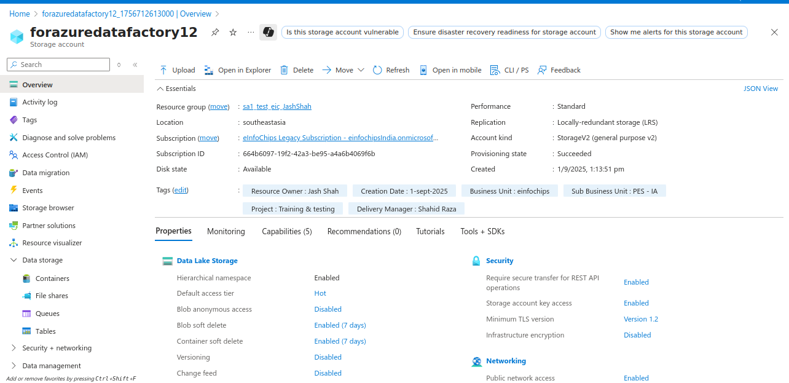
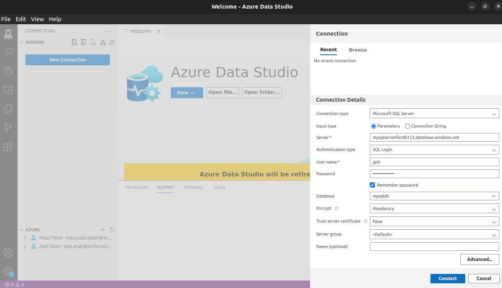
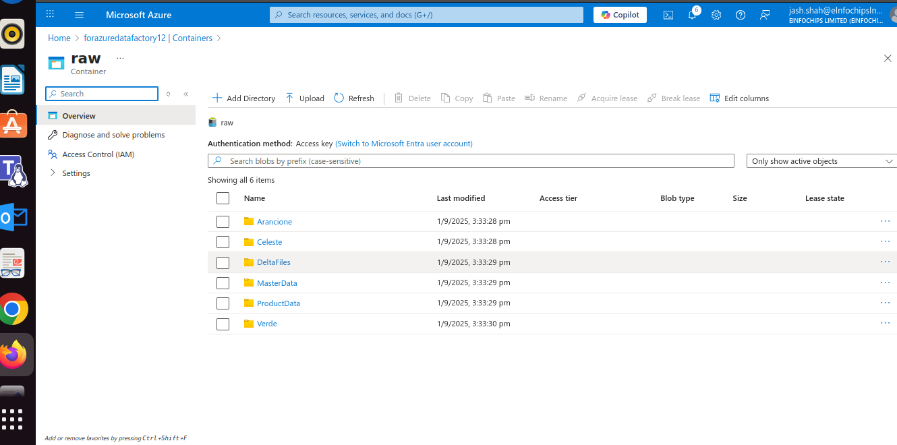
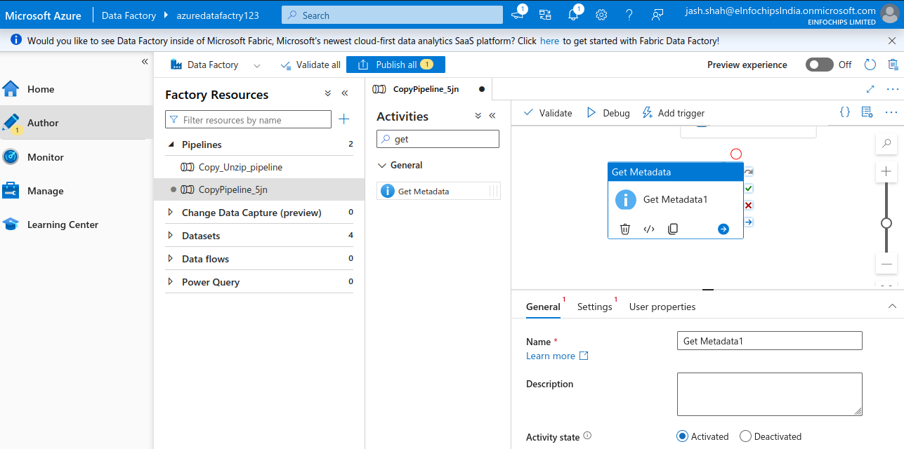

**Azure Data Factory**

**ADF managed service in the cloud for scale-out serverless data
integration, data transformation and orchestration**

-   **Azure data factory is PaaS service , so we don\'t requried to
    > manage the patching , upgrading, maintaining and provisioning
    > infrastructure on cloud and on-premises etc and there is no
    > upfront cost**

Managed service in the cloud for scale-out serverless data integration,
data transformation & orchestration.

Pay for what we use

**Benefits of azure data factory:**

Data Transformation

Data Integration

Orchestration

Software Tools which require for this project

-   VS Code & extensions

-   Git or Azure Devops

Azure Resources that we will need

Azure data lake , Data factory, Azure Sql DB, Storage account

Create a storage account for data lake

Create Azure Data factory

Azure Data Studio Integration with Mysql

Azure Storage Explorer Setup

1.  Landing - The data arrive to this containers. Just drop data as it
    > is. No changes.

2.  Raw - The raw data like json and csv file will be stored here
    > without process. Data is still unstructured but you organized it
    > by folders, date etc.

3.  Cleansed - Cleaned, stores Unique data and remove duplicates. we
    > will process the data from cleansed contianer into a staging layer
    > within Azure SQL DB.

Running the First Data Pipeline to Azure data factory

The aim of this pipeline to copy and unzip the the data which inside the
raw container and paste and unzip from lending container.

Another pipeline the aim of this pipeline to cleanse the data and paste
it into cleanse named container extract it to salesdata

Key-vault ser

Importing Semi Structured data

Modification and transform the data

#### **Mapping Data Flows**

-   data flow : data flow is a visual tool that allows you to design and
    > build data transformation logic without writing code. This is a
    > key component of ADF, designed for data engineers to create
    > complex data workflows using a drag-and-drop interface. The data
    > flows are then executed on scaled-out Apache Spark clusters
    > managed by Azure, which handles all the code translation and
    > optimization behind the scenes

Implementing Flowlets

Implementing with pipeline

Asserts

Data Warehouse

Data Processing

**Triggers**

Creating a master pipeline to execute two pipelines

Creating triggers

Trigger Executed

There is cost associated with pipeline run so we should schedule it.

Monitoring

What to Monitor

-   Data Factory Resources

-   Pipelines

-   Activities

-   Triggers

-   Integration Run time

Integration Run Time

Metrics

