**Microsoft Azure**

**Azure Console**

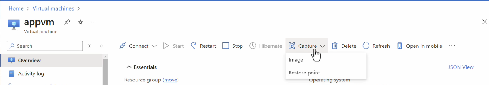

**Creating an Ubuntu Virtual Machine in Azure**

**Connecting to that VM using SSH**

**ssh -i \<private-key-file-path\> azureuser@publicip**

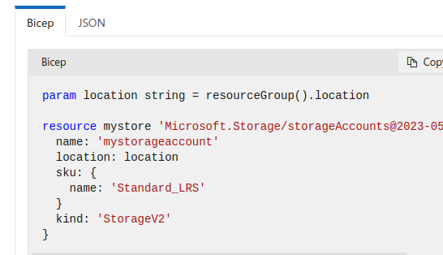

Creating a security inbound rule allowing HTTP to access nginx page

Ngnix installed successfully

Virtual Machine

each VM has its own image & we can find new images from marketplace

Azure VM has different series

Like A series - **Entry-level VMs for dev/test**

Bs Series - **Economical burstable VMs**

**D series - General purpose compute**

**Azure VM Disks**

**IOPS: (Input/Output per second)**

how many read/write operations a system can perform in one second.

Like using data base which needs high read and write operations

**Throughput**:

amount of data transferred per second.

Eg. To Copy large videos & files

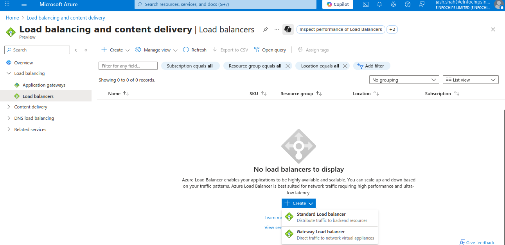

**Snapshot:**

A **snapshot** in Azure is a **point-in-time, full, read-only copy** of
a managed disk.

Create a snapshot and attach it to new VM

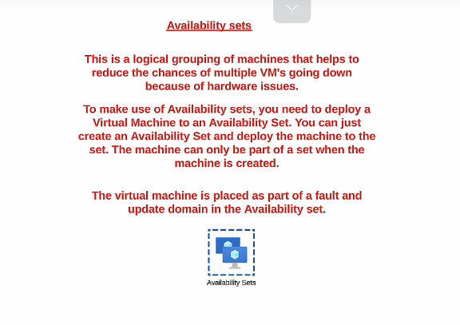{width="6.5in"
height="0.4861111111111111in"}

We can create a snapshot and then create a disk attach to an existing
disk

Generally Virtual network,Network interfaces Network Security Groups are
free of cost in azure

Public ip, Disk etc.. price depends on time.

**AZure Key-vault Service**

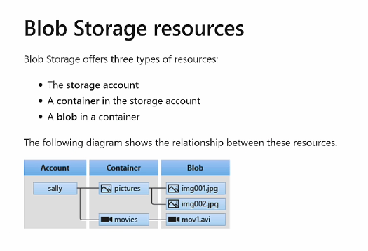

**Custom Script Extensions**

**We can also use custom data**

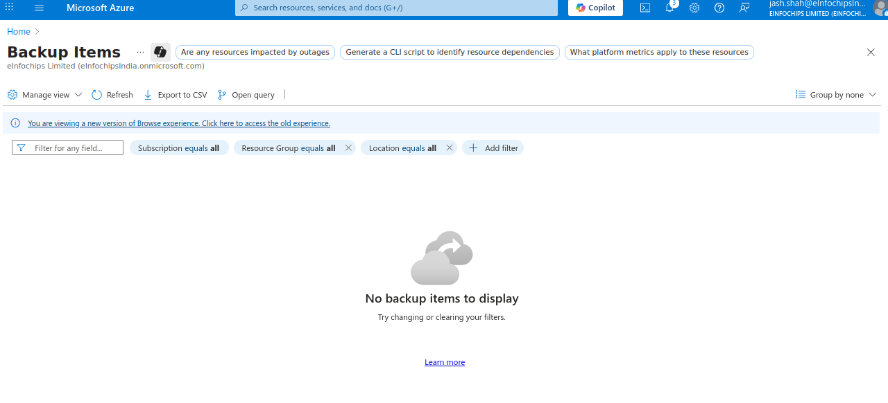

**Boot diagnostics is a feature in Azure Virtual Machines (VMs) that
helps you troubleshoot VM startup issues.**

**When you enable it, Azure captures:**

1.  **Console output (text output during boot)\
    > **

2.  **Screenshot of the VM's desktop (for Windows) or console (for
    > Linux)\
    > **

**This helps you see what's happening inside the VM when it starts up
--- useful if the VM is stuck, unresponsive, or fails to boot.**

**Run Commad:**

**Run Command in Azure lets you run scripts or commands inside an Azure
VM directly from the Azure Portal, CLI, or PowerShell --- without
needing to log in via RDP (Windows) or SSH (Linux).**

**Availability Sets**

**Availability Set → Protects against failures within one datacenter
(rack-level).\
**

**Availability Zone → Protects against failures across multiple
datacenters in a region.**

**Availability Set = a grouping feature that distributes your VMs across
multiple fault domains and update domains, ensuring higher availability
within a single Azure region datacenter.**

**AZURE Scale set**

**An Azure Virtual Machine Scale Set (VMSS) is a service that lets you
deploy and manage a set of identical VMs that can automatically scale
in/out based on demand or a defined schedule.**

**Think of it as an auto-scaling group of VMs behind a load balancer.**

-   **Automatically increase capacity when demand is high.**

-   **Automatically decrease capacity when demand is low (saving
    > cost).**

-   **Ensure high availability (VMs are spread across fault/update
    > domains or zones).**

**Virtual Machine Images**

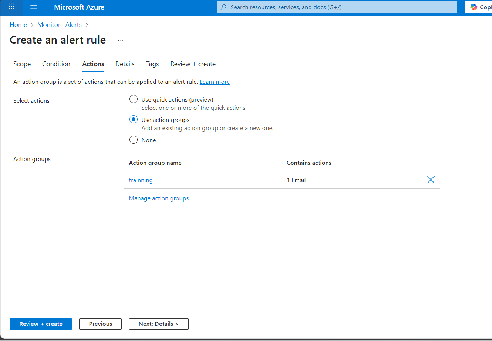

**We can create Images from an existing VM. It is the complete blueprint
of the VM which we can use to launch another VM which has the same
functionality.**

**Proximity Placement groups**

**Proximity Placement Group (PPG) is an Azure logical grouping that
ensures your Virtual Machines (VMs) are physically located close to each
other within the same datacenter.**

**Sometimes Apps need least latency ,High-Performance Computing (HPC),
n-memory databases (like Redis, SAP HANA),**

**\
**

**Azure Webapp**

**An Azure Web App is a Platform-as-a-Service (PaaS) offering from
Microsoft Azure that allows you to host, build, and scale web
applications without managing the underlying infrastructure.**

**like .NET, Java, Python, PHP, Node.js, Ruby, etc.**

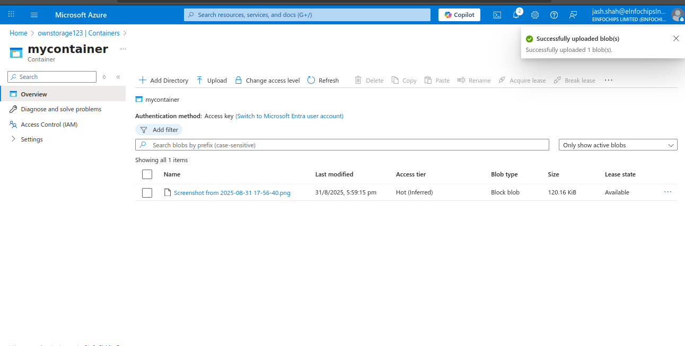

**Free plan has only 60/day of webapp**

**Azure App Service (Web Apps), Deployment Slots are like having
multiple live environments (instances) for your application within the
same App Service.**

**They allow you to safely deploy and test changes without affecting
your production app.**

**Autoscaling in azure webapp**

**Azure Container Registry**

Azure **Container Registry (ACR)** is a **managed, private Docker
registry service** provided by Microsoft Azure. It allows you to **store
and manage container images and artifacts** (like Helm charts, OCI
artifacts) that you use in your containerized applications.

Publishing an docker based image on AZure Container Registry

Azure Container Instances

**ACI** is a **serverless container service** on Azure.

It lets you **run containers directly in the cloud** without having to
manage virtual machines (VMs) or Kubernetes clusters.

You just **provide the container image** (e.g., from Docker Hub or Azure
Container Registry), and Azure runs it for you.

Multiple Container Instances are container groups

A **Container Group** is the **top-level resource in Azure Container
Instances**.

It is similar to a **Pod in Kubernetes**.

A container group can contain **one or more containers** that:

-   Share the **same host machine\
    > **

-   Share the **same network, IP address, and ports\
    > **

-   Share **data volumes**

**Private Image Storage** → Store Docker/OCI images securely in your
Azure subscription.

**Integration with Azure Services** → Works with **AKS (Azure Kubernetes
Service)**, **App Service**, **Container Instances**, etc.

**Azure Container Apps** is a **fully managed, serverless container
service** that lets you run containerized applications **without
managing infrastructure like VMs, Kubernetes, or orchestrators**.

**Virtual Network**

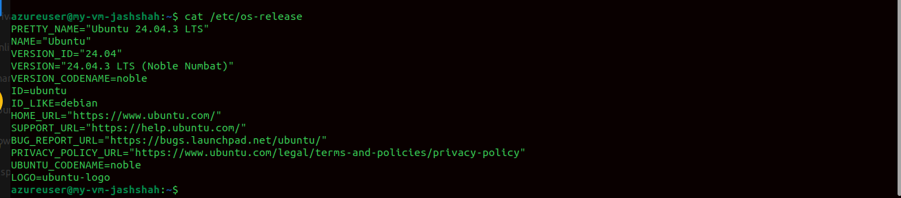

Creating a VNet

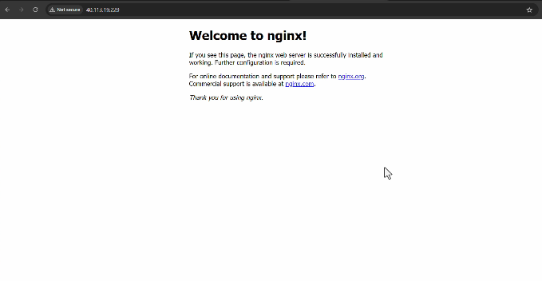

**Network Interface**

**Azure**, a **Network Interface (NIC or Network Interface Card)** is a
resource that allows an **Azure Virtual Machine (VM)** to connect to a
**Virtual Network (VNet)**.

## **Azure Bastion**

-   **Purpose: Secure administrative access (RDP/SSH) to Azure VMs
    > without exposing them to the internet means without public ip\
    > **

-   **How it works:\
    > **

    -   **Deployed inside a VNet (AzureBastionSubnet).\
        > **

    -   **Provides browser-based RDP/SSH via Azure Portal.\
        > **

    -   **Uses port 443 (HTTPS) → no need for public IPs on VMs.\
        > **

-   **Who uses it:\
    > **

    -   **Admins/Developers to log into VMs for
        > management/troubleshooting.\
        > **

**Think of Bastion as a secure "jump service" for admins.**

**Vnet Peering**

Communication between the machines of two different VNet is not possible
by default

But we can use vnet peering connection to do so.

Got Vnet ---\> peering

**Network Watcher**

**Azure Network Watcher is a network monitoring and diagnostic service
in Azure.\
**

**It helps you monitor, diagnose, and troubleshoot network issues in
your Azure Virtual Network (VNet) resources (VMs, subnets, NSGs,
connections, etc.).**

**Visualize your VNet, subnets, NICs, NSGs, and how they're connected.**

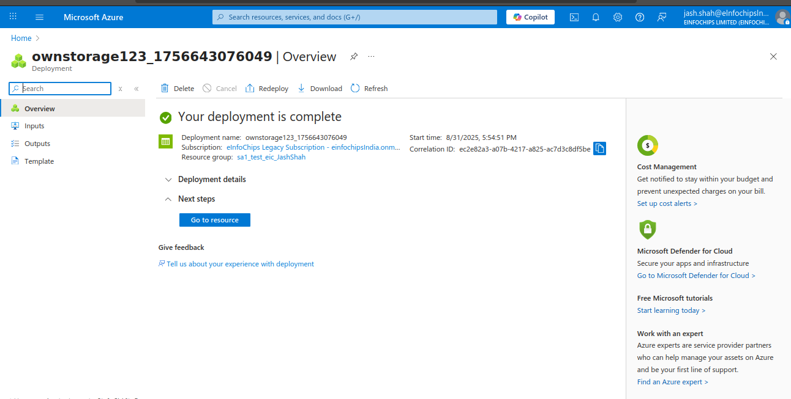

We can verify the IP flow whether access is granted or denied
