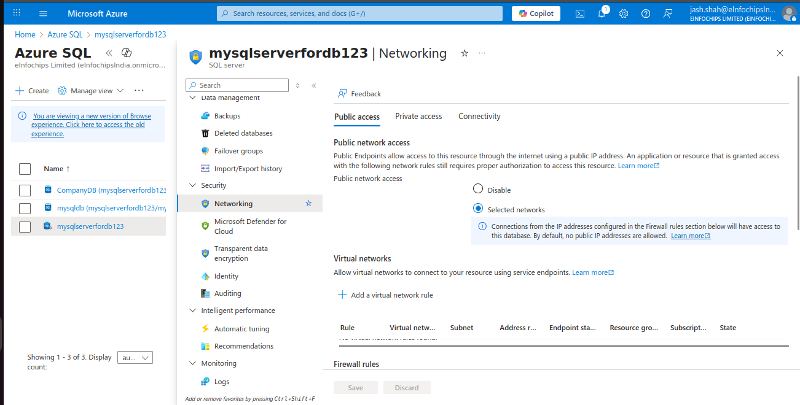

**SQL Server Deployment Options in AZUre**

**AZure Database logical server (Pass)**

**AZure Database managed instance(Pass)**

**SQL server on VM(Iaas)**

**major difference in one-liners**:

-   **SQL Database** → Fully managed single database (PaaS) with least
    > control, best for cloud-native apps.

-   **Managed Instance** → Fully managed SQL instance (PaaS) with high
    > SQL Server compatibility, good for lift-and-shift.

-   **SQL VM** → SQL Server installed on a VM (IaaS), full control of OS
    > & SQL, but you manage everything.

### **Creating Azure SQL Database :**

SQL Server Deployment Option on Azure

1.  Azure SQL Virtual Machines (IaaS)

-   This option involves running a traditional SQL Server instance on a
    > virtual machine (VM) in Azure. You have full administrative
    > control over the SQL Server instance and the underlying operating
    > system.

2.  Azure SQL Database (PaaS)

    -   This is a fully managed, intelligent, and scalable relational
        > database service. Microsoft handles the underlying
        > infrastructure, including OS patching, backups, and high
        > availability.

3.  Azure SQL Managed Instance (PaaS)

-   This is a middle ground between the full control of a VM and the
    > full management of a single database. It\'s designed to provide
    > near-complete compatibility with the latest on-premises SQL Server
    > database engine.

-   go to the azure portal and search resource Azure SQL

**Connecting SQL with Azure Data Studio** (Linux)

firewall setting : it is a way of controlling who can be allowed network
access to your online resource on Azure.

-   no go to the SQL server \> Security \> Networking \> Firewall rules
    > and add my client ip address access and Allow Azure services and
    > resources to access this server

Activity Logs

Azure SQL **Activity Log** records **management operations** (create,
update, delete, scale, firewall changes) on SQL servers/databases.

For **data-level events** (queries, logins, changes), use **SQL
Auditing**, not Activity Log.

-   A **failover group** is a **high-availability and disaster recovery
    > feature** that lets you link multiple **databases** (or even
    > entire SQL Server instances) together so that if the **primary
    > server fails**, another **secondary server** automatically takes
    > over.

-   **Auditing in Azure SQL Server** is a **security feature** that
    > tracks and logs database events (who did what, when, and from
    > where).

> It helps you:
>
> **Monitor activity** on your Azure SQL databases/servers.\
> 
>
> **Detect suspicious or unauthorized actions** (e.g., someone deleting
> tables, changing roles).

-   **Automatic Tuning** is a built-in feature in **Azure SQL Database**
    > and **Azure SQL Managed Instance** that uses AI + telemetry to
    > **continuously monitor performance** and then **automatically
    > applies fixes** to keep your database running efficiently.

-   **DTU = Database Transaction Unit**

> It's a **performance unit** used by Azure SQL Database (in the
> **DTU-based purchasing model**) to measure and bundle:

-   **Creating SQL VM with Windows based OS Image & accessing it.**

Accessing Databases using AZure data Studio.

Special Topics

A **Stretch Database** in SQL Server + Azure lets you **extend
(\"stretch\") your on-premises SQL Server database to Azure**.

**multiple SQL Server instances** on a single Azure VM, just like on a
normal Windows server.

**Provision a Windows VM in Azure** (choose size based on expected
workload).

**Download SQL Server installer (ISO/EXE)** from Microsoft.

**Run setup → New SQL Server stand-alone installation** → choose **Named
Instance** instead of default.

Repeat setup for each instance, giving each a **unique instance name**
and **different ports** (default is 1433).

Configure **SQL Server Browser** (so clients can discover named
instances).

Update **NSG/Firewall rules** on the VM to allow required ports.
