**Data Dog**

**Datadog is a cloud-based monitoring and security platform used by
developers, DevOps, IT, and security teams to keep track of
applications, infrastructure, logs, and user experience**

**Datadog covers wide range of monitoring for:**

-   **Infrastructure monitoring,**

-   **Database monitoring,**

-   **Cloud monitoring,**

-   **Log monitoring,**

-   **Application performance monitoring,**

-   **Real user monitoring,**

-   **Container monitoring,**

-   **Security monitoring,**

-   **Synthetic monitoring.**


**Architecture of Datadog**

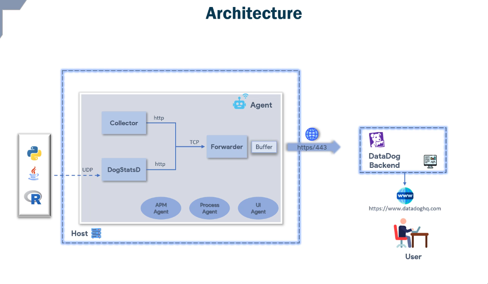

**1. Host (Server / VM / Container)**

-   This is where your application (Python, Java, R, etc.) is running.

-   Your code (via libraries, integrations, or APIs) sends metrics and logs to Datadog.

**2. DogStatsD**

-   A statsd-compatible service bundled with the Datadog Agent.

-   Applications send custom metrics via UDP (fast, low-overhead).

-   Example: your app reports response time, errors, or custom counters.

**3. Collector**

-   Collects system-level metrics (CPU, memory, disk, network, etc.)
    from the host.

-   Also gathers integration data (databases, Docker, Kubernetes, etc.)
    sing configuration files.

**4. Forwarder**

-   Both Collector and DogStatsD send their metrics to the Forwarder.

-   The Forwarder prepares the data (batching, compressing, encrypting).

-   Communication to Forwarder happens over TCP/HTTP internally.

-   **Forwarder will shift the collector\'s data to the cloud via memory
    buffer through HTTPS connections**.

**5. Buffer**

-   Temporary queue in case of connectivity issues.

-   If the Datadog backend is unreachable, data is buffered and retried
    later.

-   **Once the data reached to Datadog backend, users can access to data
     dog website https://datadoghq.com and perform aggregations on that
    data or filter them to triggers alert to the users and create
    dashboard.\
    **

**6. Agent**

-   The Agent is the overall process running on the host (contains
    > Collector, DogStatsD, Forwarder, Buffer).

-   Responsible for collecting, processing, and sending
    > metrics/logs/traces to Datadog.

**7. Datadog Backend**

-   Metrics, logs, and traces are sent via HTTPS (port 443) to Datadog's
     cloud platform
    ([[https://www.datadoghq.com]{.underline}](https://www.datadoghq.com)).

-   Once there, the data is stored, visualized, and used for dashboards,
     alerts, and analytics.

**8. User**

-   The end user (you) logs into Datadog's web UI to see dashboards,
     create monitors, set alerts, and analyze system/application
     health.

There is 3 more agent works if it is enabled in conf file.

**APM Agent** - Process to collect traces. Process Agent - Process to
collect live process info.

UI Agent - It is UI Side of data dog agent. If you want to see the
datails of Datadog agent in UI, then Datadog provides you UI component
which runs directly on the host where the datadog agent is running.

Datadog conf file is located at /etc/datadog-agent/datadog.yaml

/etc/datadog-agent/conf.d/ - contains config files related to
integrations that are run on the host where the datadog agent is
running.

The metrics coming from the host is divided into 3 apps

1.  Agent related metrics

2.  ntp metrics

3.  system metrics

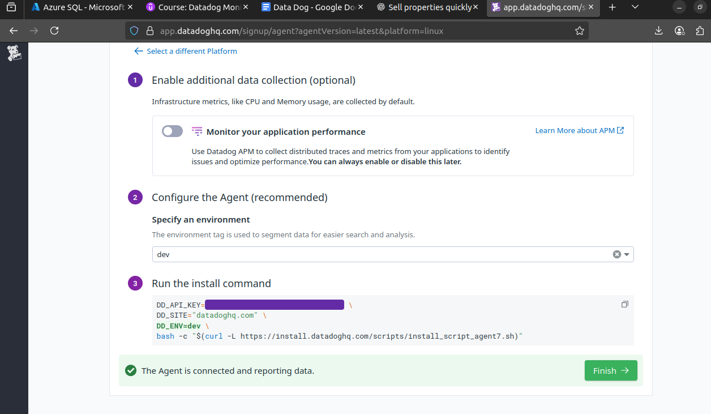

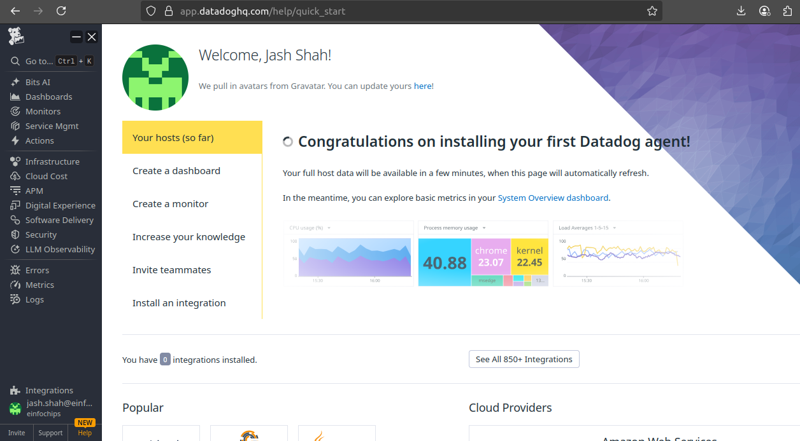

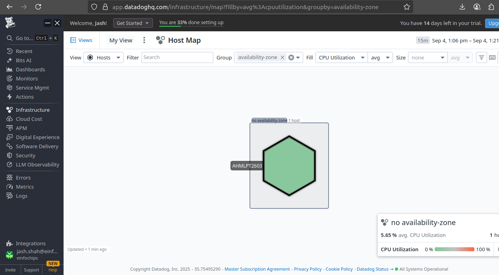

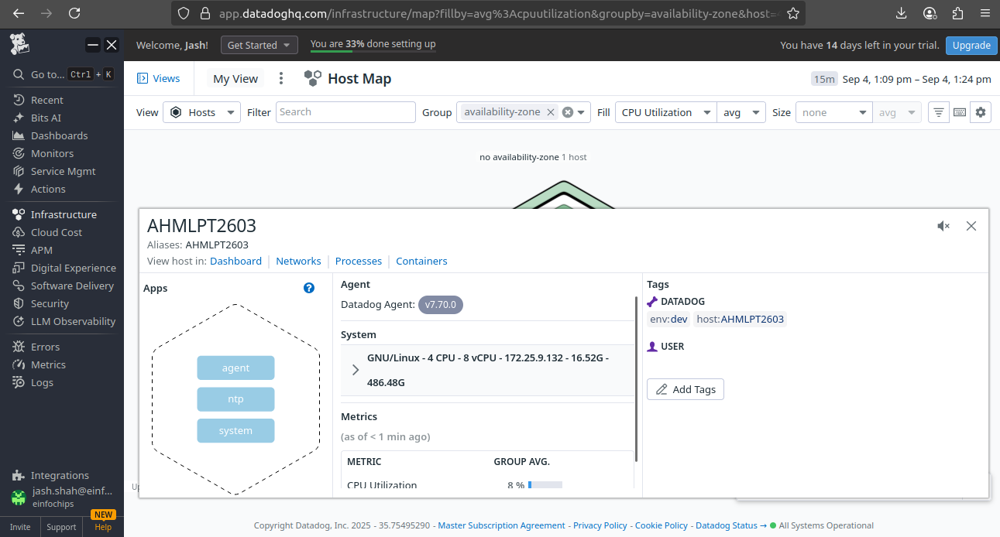

Created a VM & Installed DataDog Agent into that using Add extensions

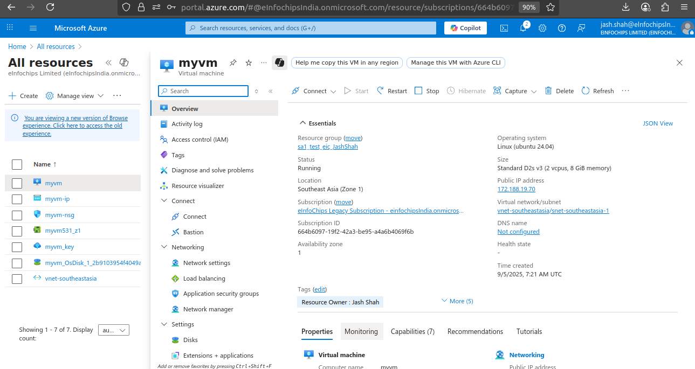

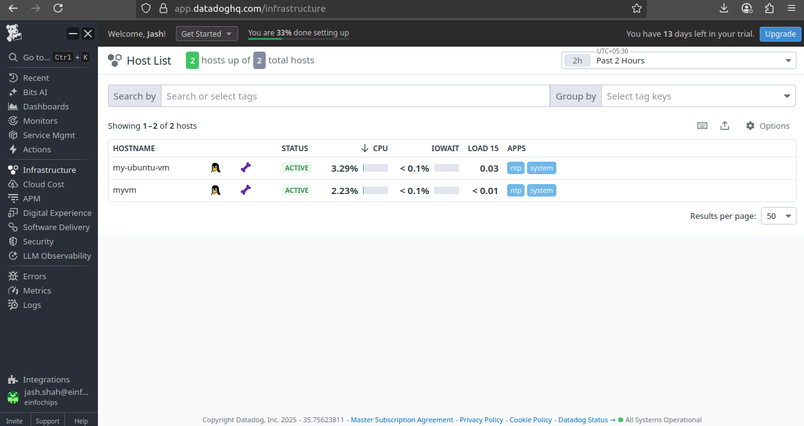

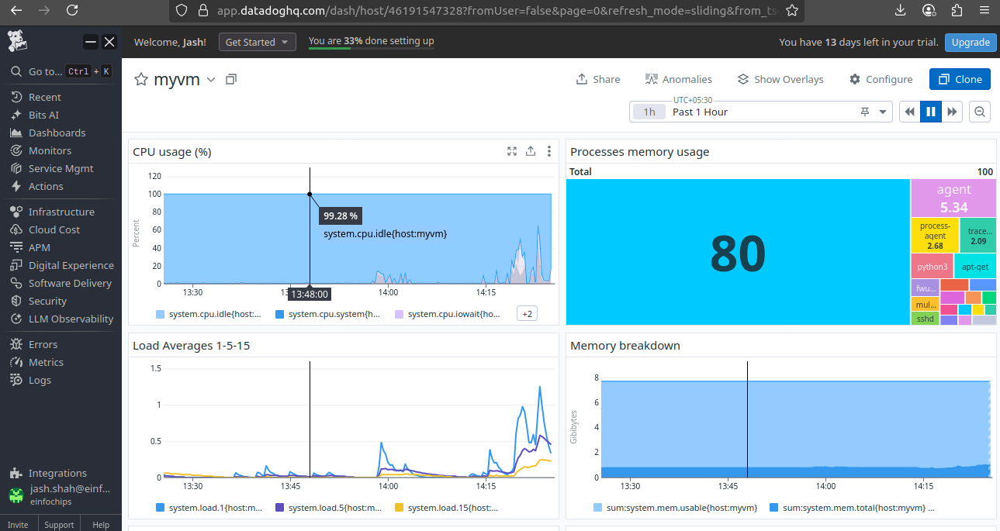

#### **Tags in Datadog**

Tagging in Datadog is a crucial feature that allows you to organize,
filter, and aggregate monitoring data from your infrastructure,
applications, and services. Tags are key-value pairs that you attach to
your metrics, logs, and traces to provide context and metadata.

-   Think of tags as labels that help you slice and dice your data.
    > Instead of just seeing a single \"CPU usage\" metric, you can see
    > the CPU usage for service:web-frontend or env:production. This
    > helps you easily find what you\'re looking for and troubleshoot
    > issues more efficiently.

How Tags Are Used

-   Filtering: You can filter dashboards and graphs to show data only
    > for a specific tag. For example, you can build a dashboard that
    > shows the performance of all your hosts in the region:us-east-1.

-   Grouping and Aggregating: Tags allow you to group related data. You
    > can group metrics by host, service, version, or any other tag to
    > see aggregated performance across a specific dimension.

-   Searching: When searching through logs or traces, tags allow you to
    > quickly narrow down your search results. For example, you can
    > search for all logs from a specific container_id or user_id.

-   Alerting: You can create more granular and targeted alerts using
    > tags. For example, you can set up an alert that only notifies you
    > if the CPU usage is high for a specific team, like team:billing.

Key Reserved Tags

-   host: Identifies the host or server where the data originated. This
    > is a fundamental tag for Datadog\'s infrastructure monitoring.

-   device: Used to distinguish between different devices on the same
    > host, such as a disk drive.

-   service: Represents a logical service or application. This is a
    > crucial tag for monitoring microservices and is often used for APM
    > (Application Performance Monitoring).

-   env: Short for environment, this tag is used to differentiate
    > between production, staging, development, and other environments.

-   version: Specifies the version of the application or service. This
    > is especially useful for tracking performance changes after a new
    > deployment.

-   container_id: Automatically collected from containerized
    > environments (like Docker and Kubernetes) to identify specific
    > containers.

-   pod_name: Used to identify Kubernetes pods.

-   kube_cluster_name: Identifies the Kubernetes cluster.

-   gcp_project_id: Used to identify the Google Cloud Platform project.

-   aws_account_id: Identifies the AWS account.

-   azure_subscription_id: Identifies the Azure subscription.

-   added tags using Ui

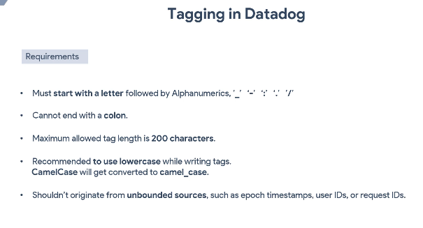

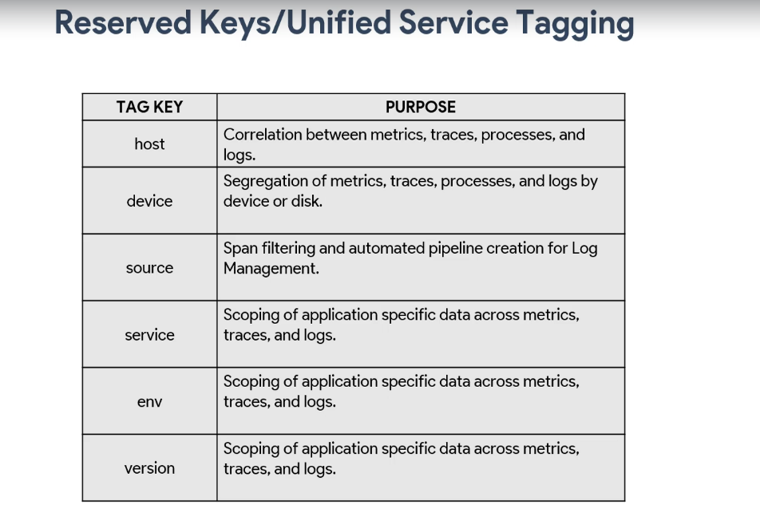

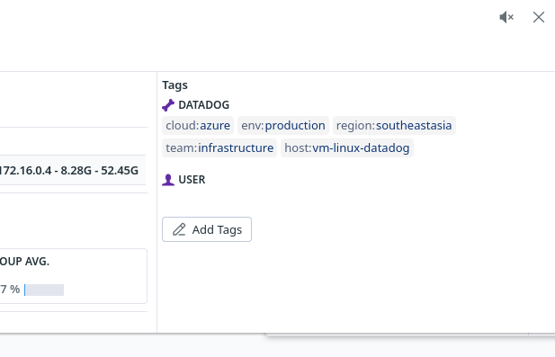

**Infrastructure Monitoring**

We can add new host in ubuntu machine systems by using below commands

sudo nano /etc/datadog-agent/datadog.yaml

Edit this into file

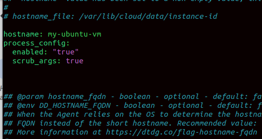

Run : sudo systemctl restart datadog-agent

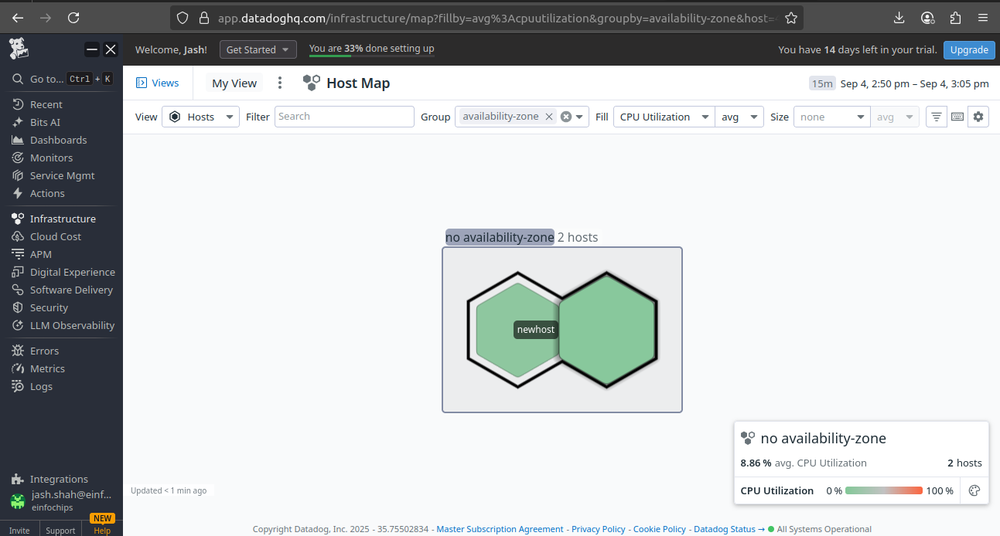

Processes of datadog

**hostname: vm-linux-datadog**

**tags:**

**- env:production**

**- team:infrastructure**

**- cloud:azure**

**- region:southeastasia**

**\# Enable process monitoring**

**process_config:**

**enabled: \"true\"**

**\# Enable network monitoring**

**network_config:**

**enabled: true**

**\# Enable logs collection**

**logs_enabled: true**

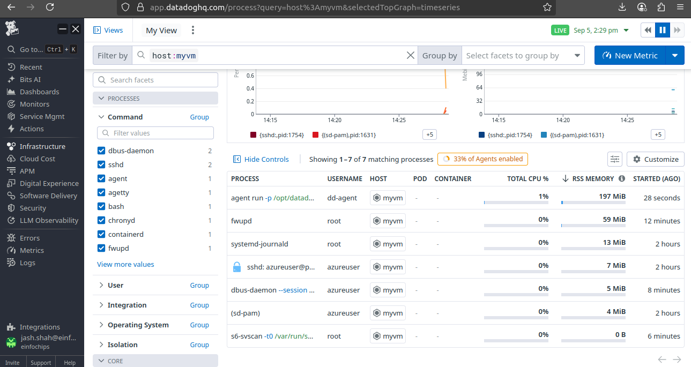

Docker agent installation

\# Run with comprehensive monitoring

docker run -d \--name datadog-agent \\

\--cgroupns host \\

\--pid host \\

-e DD_API_KEY=\<YOUR_API_KEY\> \\

-e DD_SITE=\"datadoghq.com\" \\

-e DD_HOSTNAME=\"docker-host\" \\

-e DD_TAGS=\"env:production,team:devops\" \\

-e DD_PROCESS_AGENT_ENABLED=true \\

-e DD_LOGS_ENABLED=true \\

-e DD_LOGS_CONFIG_CONTAINER_COLLECT_ALL=true \\

-e DD_CONTAINER_EXCLUDE=\"name:datadog-agent\" \\

-v /var/run/docker.sock:/var/run/docker.sock:ro \\

-v /proc/:/host/proc/:ro \\

-v /sys/fs/cgroup/:/host/sys/fs/cgroup:ro \\

-v /var/lib/docker/containers:/var/lib/docker/containers:ro \\

-v /opt/datadog-agent/run:/opt/datadog-agent/run:rw \\

datadog/agent:latest

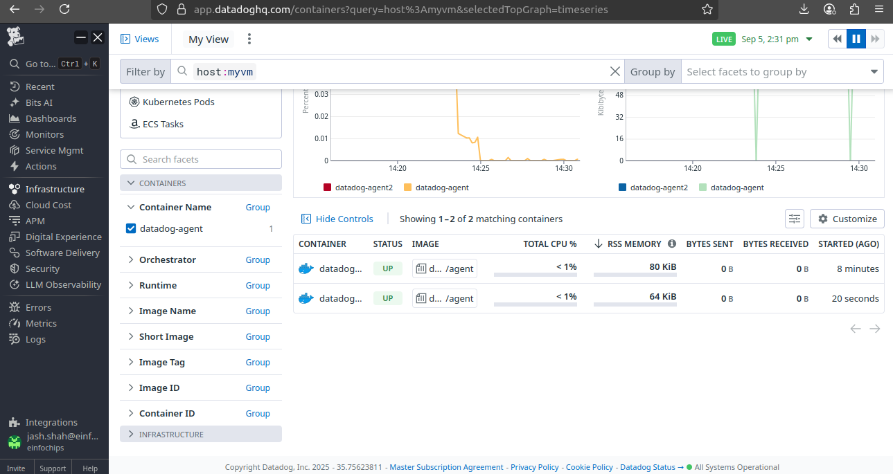
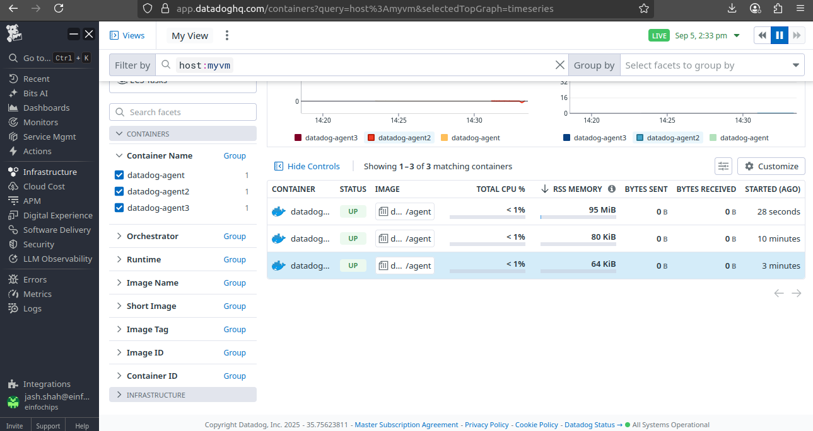

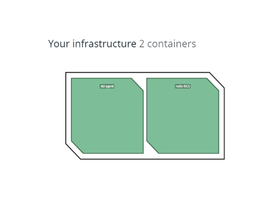

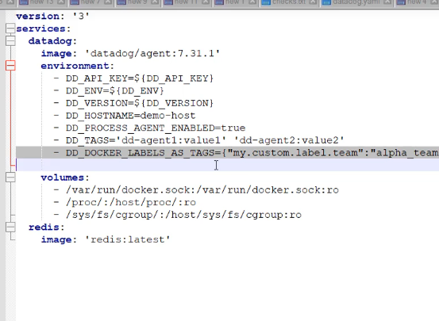

Run docker agent from dockerfile

### **Application Container with Labels**

\# Run application with DataDog labels

docker run -d \--name web-server \\

\--label com.datadoghq.ad.logs=\'\[{\"source\": \"nginx\", \"service\":
\"web-server\"}\]\' \\

\--label com.datadoghq.ad.check_names=\'\[\"nginx\"\]\' \\

\--label com.datadoghq.ad.init_configs=\'\[{}\]\' \\

\--label com.datadoghq.ad.instances=\'\[{\"nginx_status_url\":
\"http://%%host%%:%%port%%/nginx_status\"}\]\' \\

-p 8080:80 \\

nginx:alpine

Types of metrics

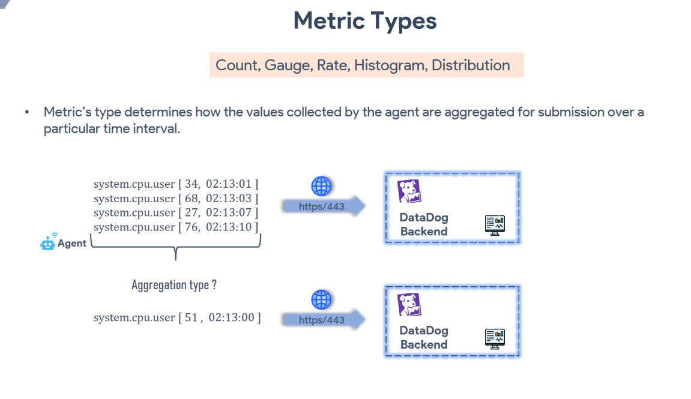

## **Core Metric Types in Datadog**

**Gauge\
**

-   Represents a single value at a given point in time.

-   Goes up or down (e.g., CPU usage, memory, temperature).

**Count**

-   A single **monotonic counter** (cumulative value).

-   Represents the number of events over a time interval.

**Rate**

-   A counter converted into a per-second rate.

-   Useful for throughput metrics (requests/sec, bytes/sec).

**Distribution**

-   Captures a statistical distribution of values across hosts/services.

-   Lets you see **p95, p99, avg, min, max** across multiple sources.

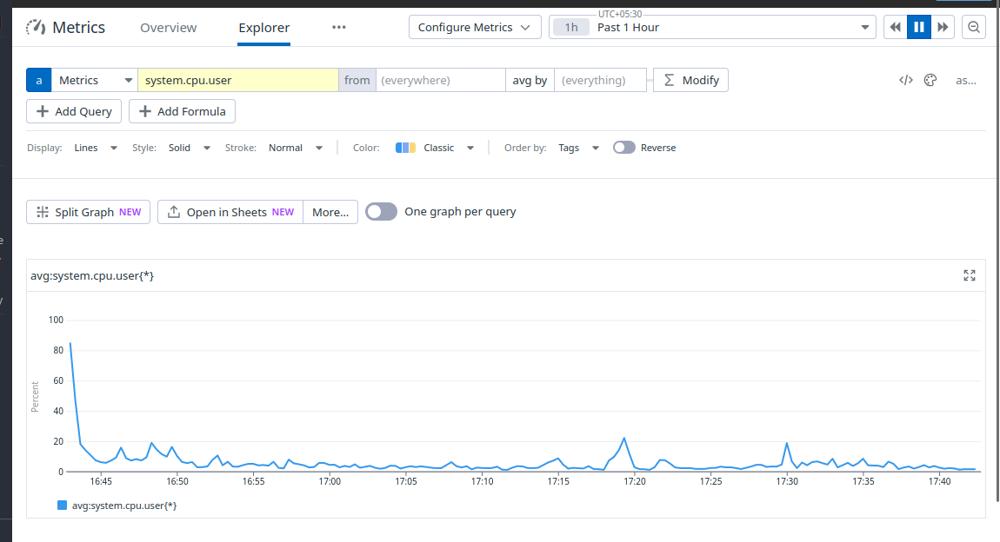

**Custom metric creation**

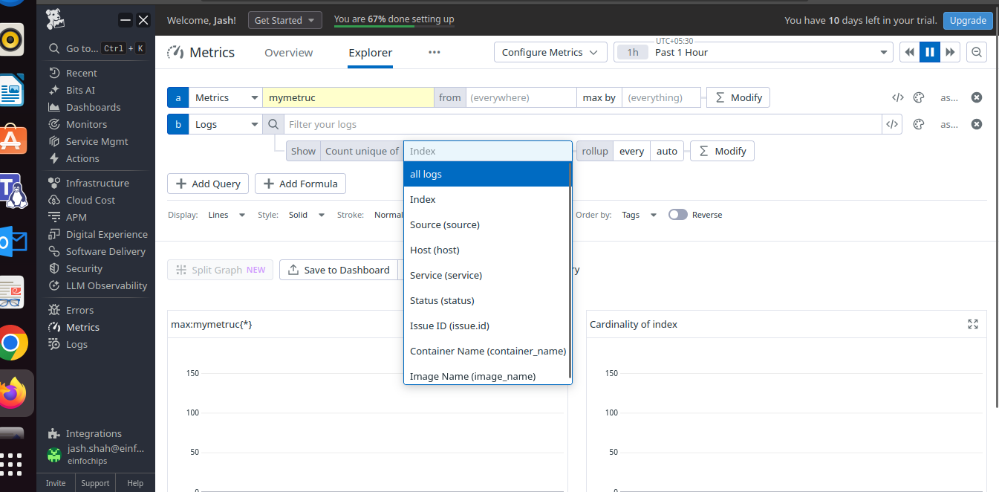

Event Monitoring

**Metrics** = numerical values collected over time (CPU %, memory,
requests/sec).

**Events** = things that *happen* at a point in time (deployment,
restart, error, alert, notification, custom message).

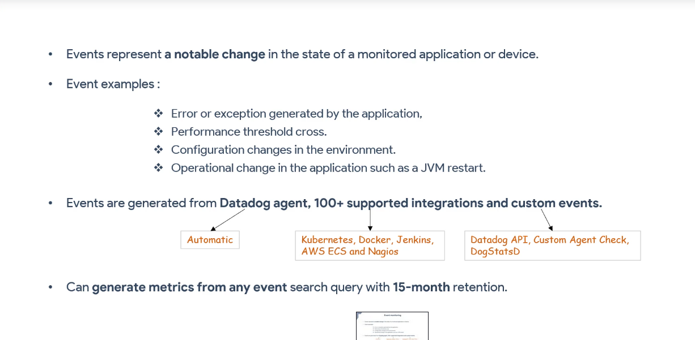

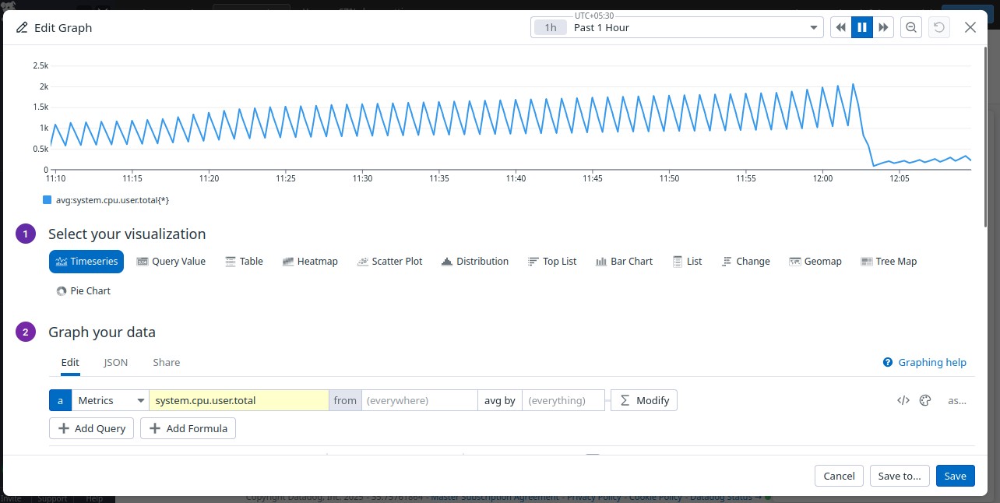

**Monitors & Alerts**

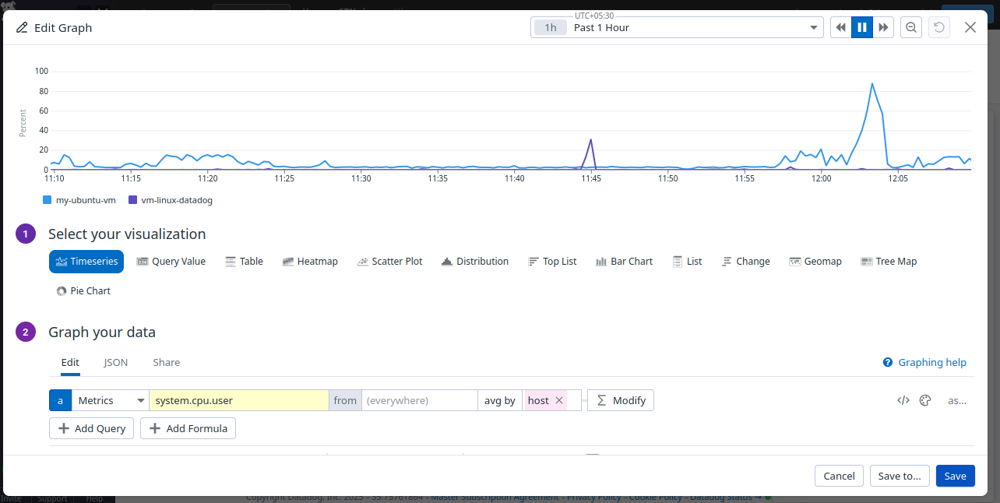

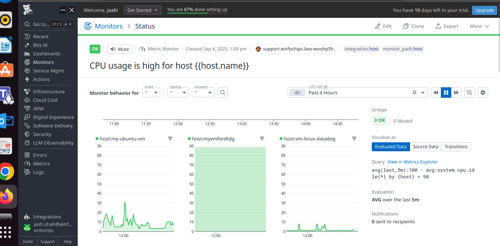

Log & Log Management

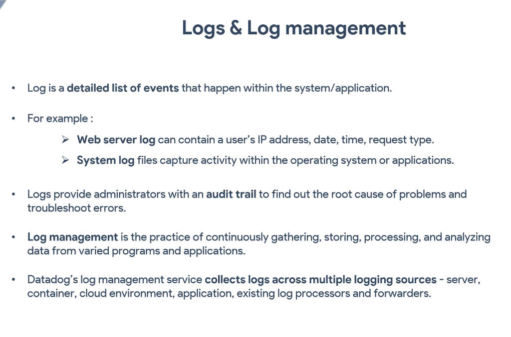

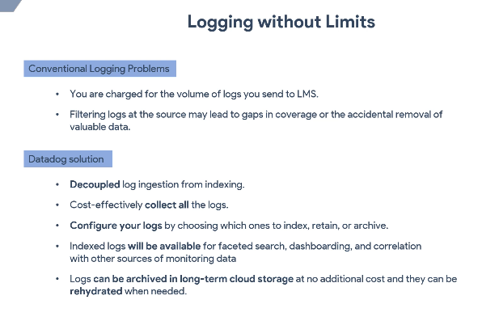

### **Step 1: Enable Log Collection**

\# Agent with log collection

docker run -d \--name datadog-agent \\

-e DD_API_KEY=\<YOUR_API_KEY\> \\

-e DD_LOGS_ENABLED=true \\

-e DD_LOGS_CONFIG_CONTAINER_COLLECT_ALL=true \\

-e DD_LOGS_CONFIG_AUTO_MULTI_LINE_DETECTION=true \\

-v /var/run/docker.sock:/var/run/docker.sock:ro \\

-v /var/lib/docker/containers:/var/lib/docker/containers:ro \\

-v /proc/:/host/proc/:ro \\

-v /sys/fs/cgroup/:/host/sys/fs/cgroup:ro \\

datadog/agent:latest

### **Step 2: Container with Custom Log Configuration**

\# Application with log labels

docker run -d \--name app-with-logs \\

\--label com.datadoghq.ad.logs=\'\[{\"source\": \"python\", \"service\":
\"my-app\", \"log_processing_rules\": \[{\"type\": \"multi_line\",
\"name\": \"log_start_with_date\", \"pattern\":
\"\\\\d{4}\\\\-(0?\[1-9\]\|1\[012\])\\\\-(0?\[1-9\]\|\[12\]\[0-9\]\|3\[01\])\"}\]}\]\'
\\

python:3.9 \\

python -c \"import time; \[print(f\'2023-01-01 INFO: Message {i}\') or
time.sleep(1) for i in range(1000)\]\"

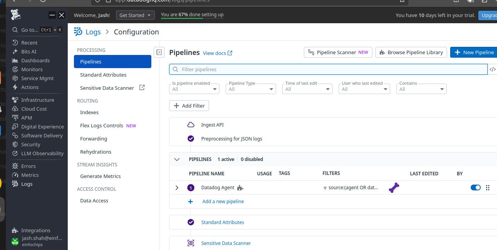

**Integrations in Datadog**

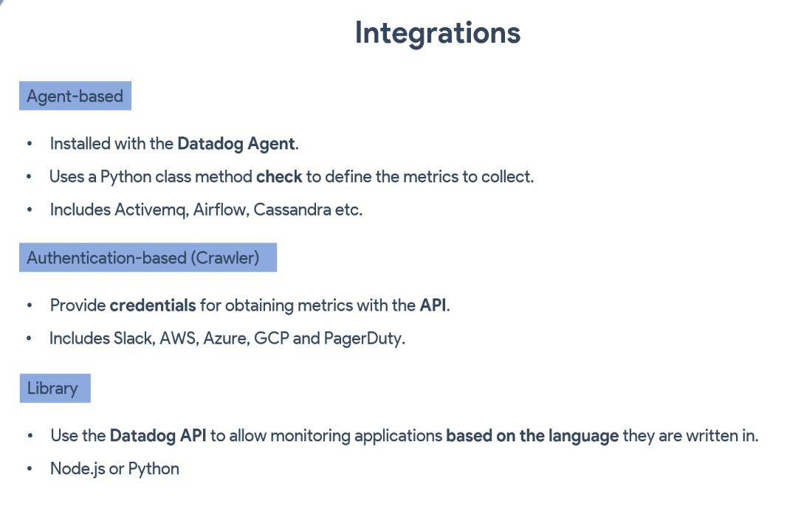

**Application Performance Monitoring**

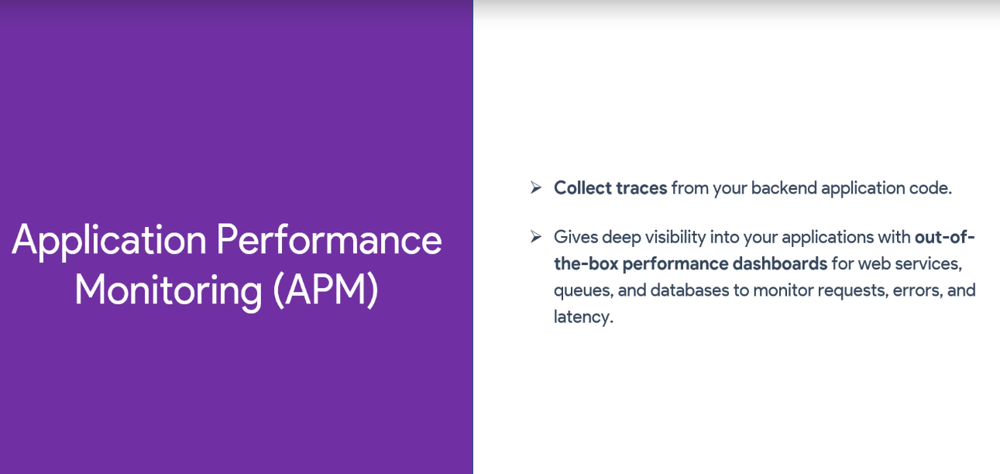

# **DataDog: Application Performance Monitoring (APM) with DataDog**

## **Prerequisites**

-   DataDog account with APM enabled

-   Python 3.7+ installed

-   Weather application from APM_1 folder

-   DataDog Agent running (from previous tasks)

Installing python in VM

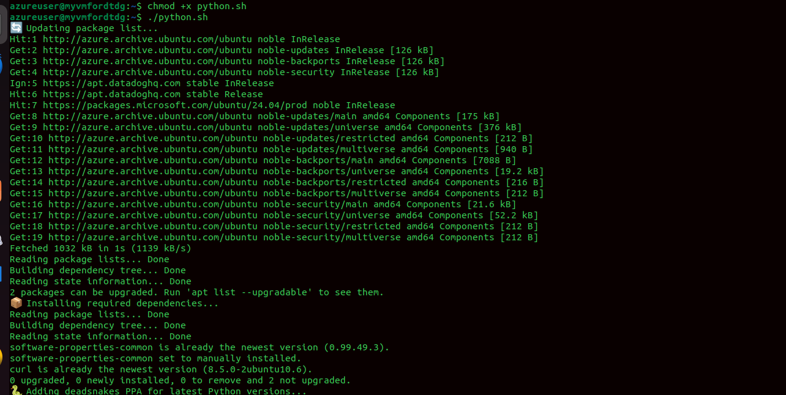

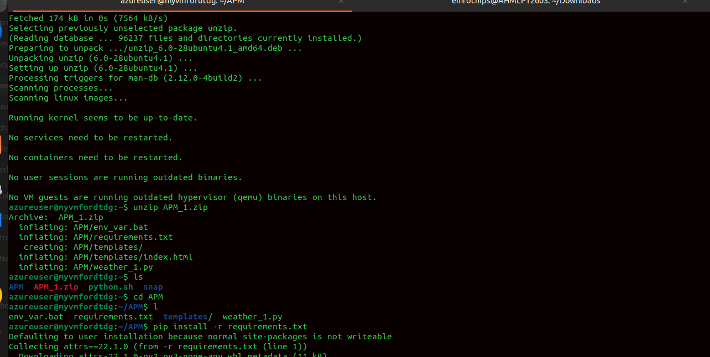

### **Step 1: Prepare the Weather Application**
```bash
First, let\'s fix the requirements.txt file and set up the application:

\# Navigate to APM folder

cd DataDog-day16/APM_1/

\# Create clean requirements.txt

cat \> requirements.txt \<\< EOF

Flask==2.3.3

Flask-SQLAlchemy==3.0.5

ddtrace==1.19.0

requests==2.31.0

EOF

\# Install dependencies

pip install -r requirements.txt
```
### **Step 2: Instrument the Weather Application**

### First, let\'s fix the requirements.txt file and set up the application:
```bash
 \# Navigate to APM folder

 cd DataDog-day16/APM_1/

 

 \# Create clean requirements.txt

 cat \> requirements.txt \<\< EOF

 Flask==2.3.3

 Flask-SQLAlchemy==3.0.5

 ddtrace==1.19.0

 requests==2.31.0

 EOF

 ```

### \# Install dependencies

 pip install -r requirements.txt

 Step 2: Instrument the Weather Application

 **Create an enhanced version of the weather application with DataDog APM:**
```bash
 \# weather_apm.py
from flask import Flask, request, render_template, abort, jsonify
from flask_sqlalchemy import SQLAlchemy
from sqlalchemy.sql import func

import os
import json
import requests
import time
import random

# DataDog APM imports
from ddtrace import tracer, patch_all
from ddtrace.contrib.flask import TraceMiddleware

# Auto-instrument common libraries
patch_all()

app = Flask(__name__)

# Initialize DataDog tracing
TraceMiddleware(app, tracer, service="weather-app")

# Database configuration
basedir = os.path.abspath(os.path.dirname(__file__))
app.config['SQLALCHEMY_DATABASE_URI'] = 'sqlite:///' + os.path.join(basedir, 'weather.db')
app.config['SQLALCHEMY_TRACK_MODIFICATIONS'] = False

db = SQLAlchemy(app)

class Weather(db.Model):
    id = db.Column(db.Integer, primary_key=True)
    country_code = db.Column(db.String(5), nullable=False)
    coordinate = db.Column(db.String(20), nullable=False)
    temp = db.Column(db.String(5))
    pressure = db.Column(db.Integer)
    humidity = db.Column(db.Integer)
    cityname = db.Column(db.String(80), nullable=False)
    created_at = db.Column(db.DateTime(timezone=True), server_default=func.now())

with app.app_context():
    db.create_all()

@tracer.wrap("temperature.conversion")
def tocelcius(temp):
    """Convert Kelvin to Celsius with tracing"""
    with tracer.trace("temperature.calculation") as span:
        span.set_tag("input.temp", temp)
        celsius = round(float(temp) - 273.16, 2)
        span.set_tag("output.celsius", celsius)
        return str(celsius)

@tracer.wrap("database.save_weather")
def save_to_database(weather_details):
    """Save weather data to database with tracing"""
    with tracer.trace("database.insert") as span:
        span.set_tag("city", weather_details["cityname"])
        span.set_tag("country", weather_details["country_code"])

        weather = Weather(
            country_code=weather_details["country_code"],
            coordinate=weather_details["coordinate"],
            temp=weather_details["temp"],
            pressure=int(weather_details["pressure"]),
            humidity=int(weather_details["humidity"]),
            cityname=weather_details["cityname"]
        )

        try:
            db.session.add(weather)
            db.session.commit()
            span.set_tag("database.operation", "success")
        except Exception as e:
            span.set_tag("database.operation", "failed")
            span.set_tag("error", str(e))
            raise

@tracer.wrap("api.weather_fetch")
def get_weather_details(city):
    """Fetch weather data from OpenWeatherMap API with tracing"""
    api_key = '48a90ac42c53f4a4e2b8b5d3a7f8c9d1'  # Replace with valid API key

    with tracer.trace("external.api.call") as span:
        span.set_tag("api.provider", "openweathermap")
        span.set_tag("api.city", city)
        span.set_tag("api.endpoint", "weather")

        try:
            # Add artificial delay for demonstration
            time.sleep(random.uniform(0.1, 0.5))

            url = f'http://api.openweathermap.org/data/2.5/weather?q={city}&appid={api_key}'
            response = requests.get(url, timeout=10)

            span.set_tag("http.status_code", response.status_code)
            span.set_tag("http.url", url)

            if response.status_code != 200:
                span.set_tag("error", True)
                span.set_tag("error.message", f"API returned {response.status_code}")
                return abort(400)

            list_of_data = response.json()

            # Process weather data
            data = {
                "country_code": str(list_of_data['sys']['country']),
                "coordinate": f"{list_of_data['coord']['lon']} {list_of_data['coord']['lat']}",
                "temp": f"{list_of_data['main']['temp']}k",
                "temp_cel": f"{tocelcius(list_of_data['main']['temp'])}C",
                "pressure": str(list_of_data['main']['pressure']),
                "humidity": str(list_of_data['main']['humidity']),
                "cityname": str(city),
            }

            span.set_tag("weather.temperature", data["temp_cel"])
            span.set_tag("weather.humidity", data["humidity"])

            save_to_database(data)
            return data

        except requests.exceptions.RequestException as e:
            span.set_tag("error", True)
            span.set_tag("error.message", str(e))
            tracer.current_span().set_tag("error.type", "network_error")
            return abort(500)
        except Exception as e:
            span.set_tag("error", True)
            span.set_tag("error.message", str(e))
            return abort(500)

@app.route('/', methods=['POST', 'GET'])
def weather():
    """Main weather endpoint with tracing"""
    with tracer.trace("web.request") as span:
        span.set_tag("http.method", request.method)

        if request.method == 'POST':
            city = request.form.get('city', 'Delhi')
            span.set_tag("request.type", "form_submission")
        else:
            city = 'Delhi'  # Default city
            span.set_tag("request.type", "default_load")

        span.set_tag("weather.city", city)

        try:
            data = get_weather_details(city)
            span.set_tag("response.status", "success")
            return render_template('index.html', data=data)
        except Exception as e:
            span.set_tag("response.status", "error")
            span.set_tag("error.message", str(e))
            return render_template('index.html', data={}, error=str(e))

@app.route('/health')
def health_check():
    """Health check endpoint"""
    with tracer.trace("health.check") as span:
        span.set_tag("service.health", "ok")
        return jsonify({"status": "healthy", "service": "weather-app"})

@app.route('/api/weather/<city>')
def api_weather(city):
    """API endpoint for weather data"""
    with tracer.trace("api.weather") as span:
        span.set_tag("api.city", city)
        try:
            data = get_weather_details(city)
            return jsonify(data)
        except Exception as e:
            span.set_tag("error", True)
            return jsonify({"error": str(e)}), 500

@app.route('/metrics')
def custom_metrics():
    """Endpoint to generate custom metrics"""
    from ddtrace import tracer
    from datadog import statsd

    # Custom metrics
    statsd.increment('weather.api.requests')
    statsd.histogram('weather.response.time', random.uniform(0.1, 2.0))
    statsd.gauge('weather.active.users', random.randint(1, 100))

    return jsonify({"message": "Metrics sent"})

if __name__ == '__main__':
    app.run(host='0.0.0.0', port=8000, debug=True)
```

### Step 3: Environment Configuration

### Create environment setup script:

### \# setup_apm_env.sh
```bash
#!/bin/bash

export DD_SERVICE="weather-app"
export DD_ENV="production"
export DD_VERSION="v1.0.0"
export DD_TAGS="team:backend,component:api"
export DD_TRACE_SAMPLE_RATE="1.0"
export DD_LOGS_INJECTION="true"
export DD_TRACE_ANALYTICS_ENABLED="true"
export DD_PROFILING_ENABLED="true"
export DD_AGENT_HOST="localhost"
export DD_TRACE_AGENT_PORT="8126"

echo "DataDog APM environment configured"
```

## Part 2: Running the Application with APM

### Step 1: Start Application with DataDog Tracing

### \# Method 1: Using ddtrace-run (recommended)

### ddtrace-run python weather_apm.py

### 

### \# Method 2: Using environment variables

### DD_SERVICE=weather-app DD_ENV=production ddtrace-run python weather_apm.py

### 

### \# Method 3: Manual configuration (already done in code)

### python weather_apm.py

### Step 2: Generate Traffic for Testing

### Create a load testing script:

### \# load_test.py
```bash
 import requests
 import time
 import random
 import threading

 BASE_URL = \"http://localhost:8000\"

 CITIES = \[\"London\", \"Paris\", \"Tokyo\", \"New York\", \"Mumbai\", \"Sydney\", \"Berlin\", \"Invalid_City\"\]
 def make_request():

  \"\"\"Make a single request to the weather app\"\"\"

  try:

city = random.choice(CITIES)  

\# Test different endpoints

endpoints = \[

f\"/api/weather/{city}\",

\"/\",

\"/health\",

  \"/metrics\"
 endpoint = random.choice(endpoints)  
if endpoint == \"/\":

\# Form submission

###  response = requests.post(BASE_URL + endpoint, data={\"city\": city})

###  else:

###  response = requests.get(BASE_URL + endpoint)

###  

###  print(f\"Request to {endpoint}: {response.status_code}\")

###  

###  except Exception as e:

###  print(f\"Error: {e}\")

### 

 def load_test(duration=300, threads=5):

  \"\"\"Run load test for specified duration\"\"\"

  print(f\"Starting load test for {duration} seconds with {threads} threads\")

  

def worker():

end_time = time.time() + duration
while time.time() \< end_time:
make_request()

time.sleep(random.uniform(0.5, 2.0))

 

###  \# Start threads

###  thread_list = \[\]

###  for i in range(threads):

###  t = threading.Thread(target=worker)

###  t.start()

###  thread_list.append(t)

###  

###  \# Wait for completion

###  for t in thread_list:

###  t.join()

###  

###  print(\"Load test completed\")

### 

### if \_\_name\_\_ == \"\_\_main\_\_\":

###  load_test(duration=180, threads=3)

### \# Run load test

### python load_test.py
```

## Part 3: Advanced APM Configuration

### Step 1: Custom Instrumentation

### Add custom instrumentation to the application:

### \# custom_instrumentation.py
from ddtrace import tracer
from ddtrace.ext import http, db
import functools
import time


def trace_function(service_name, resource_name=None):
    """Decorator for custom function tracing"""
    def decorator(func):
        @functools.wraps(func)
        def wrapper(*args, **kwargs):
            with tracer.trace(
                name=f"{service_name}.{func.__name__}",
                service=service_name,
                resource=resource_name or func.__name__
            ) as span:
                span.set_tag("function.name", func.__name__)
                span.set_tag("function.args", str(args))

                start_time = time.time()
                try:
                    result = func(*args, **kwargs)
                    span.set_tag("function.result", "success")
                    return result
                except Exception as e:
                    span.set_tag("error", True)
                    span.set_tag("error.message", str(e))
                    raise
                finally:
                    duration = time.time() - start_time
                    span.set_tag("function.duration", duration)
        return wrapper
    return decorator


# Usage example
@trace_function("weather-service", "cache_lookup")
def get_cached_weather(city):
    """Simulate cache lookup with tracing"""
    time.sleep(0.1)  # Simulate cache lookup time
    return None  # Cache miss


@trace_function("weather-service", "data_validation")
def validate_weather_data(data):
    """Validate weather data with tracing"""
    required_fields = ['temp', 'humidity', 'pressure']
    for field in required_fields:
        if field not in data:
            raise ValueError(f"Missing required field: {field}")
    return True


# Step 2: Database Query Optimization Monitoring
# db_monitoring.py
```bash
from sqlalchemy import event
from sqlalchemy.engine import Engine


@event.listens_for(Engine, "before_cursor_execute")
def receive_before_cursor_execute(conn, cursor, statement, parameters, context, executemany):
    """Monitor SQL query execution"""
    context._query_start_time = time.time()

    # Create trace for SQL query
    span = tracer.trace("sql.query")
    span.set_tag("sql.query", statement)
    span.set_tag("sql.parameters", str(parameters))
    context._dd_span = span


@event.listens_for(Engine, "after_cursor_execute")
def receive_after_cursor_execute(conn, cursor, statement, parameters, context, executemany):
    """Complete SQL query monitoring"""
    if hasattr(context, '_dd_span'):
        total = time.time() - context._query_start_time
        context._dd_span.set_tag("sql.duration", total)
        context._dd_span.finish()
```

# Part 4: Error Tracking and Monitoring
# error_tracking.py
```bash
import logging
import sys

# Configure logging with DataDog
logging.basicConfig(
    level=logging.INFO,
    format='%(asctime)s - %(name)s - %(levelname)s - %(message)s'
)

logger = logging.getLogger(__name__)


def track_error(error_type, error_message, context=None):
    """Track errors with DataDog APM"""
    with tracer.trace("error.tracking") as span:
        span.set_tag("error", True)
        span.set_tag("error.type", error_type)
        span.set_tag("error.message", error_message)

        if context:
            for key, value in context.items():
                span.set_tag(f"error.context.{key}", value)

        logger.error(f"Error tracked: {error_type} - {error_message}")


# Custom exception handler
def handle_exception(exc_type, exc_value, exc_traceback):
    """Global exception handler with DataDog tracking"""
    if issubclass(exc_type, KeyboardInterrupt):
        sys.__excepthook__(exc_type, exc_value, exc_traceback)
        return

    track_error(
        error_type=exc_type.__name__,
        error_message=str(exc_value),
        context={"traceback": str(exc_traceback)}
    )

    logger.critical("Uncaught exception", exc_info=(exc_type, exc_value, exc_traceback))


# Register global exception handler
sys.excepthook = handle_exception
```
### Step 2: Performance Monitoring

### \# performance_monitoring.py
```bash
from ddtrace import tracer
from datadog import statsd
import time
import psutil
import threading


class PerformanceMonitor:
    def __init__(self, interval=30):
        self.interval = interval
        self.running = False

    def start_monitoring(self):
        """Start performance monitoring thread"""
        self.running = True
        thread = threading.Thread(target=self._monitor_loop)
        thread.daemon = True
        thread.start()

    def stop_monitoring(self):
        """Stop performance monitoring"""
        self.running = False

    def _monitor_loop(self):
        """Main monitoring loop"""
        while self.running:
            self._collect_system_metrics()
            time.sleep(self.interval)

    def _collect_system_metrics(self):
        """Collect and send system metrics"""
        with tracer.trace("system.metrics.collection") as span:
            # CPU metrics
            cpu_percent = psutil.cpu_percent(interval=1)
            statsd.gauge('system.cpu.usage', cpu_percent)
            span.set_tag("cpu.usage", cpu_percent)

            # Memory metrics
            memory = psutil.virtual_memory()
            statsd.gauge('system.memory.usage', memory.percent)
            statsd.gauge('system.memory.available', memory.available)
            span.set_tag("memory.usage", memory.percent)

            # Disk metrics
            disk = psutil.disk_usage('/')
            statsd.gauge('system.disk.usage', disk.percent)
            span.set_tag("disk.usage", disk.percent)


# Initialize performance monitoring
monitor = PerformanceMonitor()
monitor.start_monitoring()
```
## Part 5: DataDog Dashboard Configuration

### Step 1: Create Custom Dashboard
```bash
{
  "title": "Weather App APM Dashboard",
  "description": "Comprehensive monitoring for weather application",
  "widgets": [
    {
      "definition": {
        "type": "timeseries",
        "requests": [
          {
            "q": "avg:trace.flask.request.duration{service:weather-app} by {resource_name}",
            "display_type": "line",
            "style": {"palette": "dog_classic"}
          }
        ],
        "title": "Request Duration by Endpoint"
      }
    },
    {
      "definition": {
        "type": "timeseries",
        "requests": [
          {
            "q": "sum:trace.flask.request.hits{service:weather-app} by {resource_name}.as_rate()",
            "display_type": "bars"
          }
        ],
        "title": "Request Rate by Endpoint"
      }
    },
    {
      "definition": {
        "type": "timeseries",
        "requests": [
          {
            "q": "sum:trace.flask.request.errors{service:weather-app} by {resource_name}.as_rate()",
            "display_type": "line",
            "style": {"palette": "warm"}
          }
        ],
        "title": "Error Rate by Endpoint"
      }
    },
    {
      "definition": {
        "type": "query_value",
        "requests": [
          {
            "q": "avg:trace.external.api.call.duration{service:weather-app}",
            "aggregator": "avg"
          }
        ],
        "title": "Avg API Response Time"
      }
    },
    {
      "definition": {
        "type": "toplist",
        "requests": [
          {
            "q": "top(avg:trace.database.insert.duration{service:weather-app} by {city}, 10, 'mean', 'desc')"
          }
        ],
        "title": "Slowest Database Operations by City"
      }
    }
  ]
}
```
Step 2: Service Map Configuration

The service map will automatically show:
- weather-app (main Flask service)
- sqlite (database connections)
- openweathermap (external API calls)
- requests (HTTP client library)

## Part 6: Alerting Configuration

### Step 1: Performance Alerts

### \# High Response Time Alert

### name: \"Weather App - High Response Time\"

### type: \"metric alert\"

### query: \"avg(last_5m):avg:trace.flask.request.duration{service:weather-app} \> 2\"

### message: \|

###  Weather app response time is high: {{value}}s

###  

###  Troubleshooting:

###  1. Check external API performance

###  2. Review database query performance

###  3. Check system resources

### 

### \# Error Rate Alert

### name: \"Weather App - High Error Rate\"

### type: \"metric alert\"

### query: \"sum(last_5m):sum:trace.flask.request.errors{service:weather-app}.as_rate() \> 0.1\"

### message: \|

###  Weather app error rate is high: {{value}} errors/sec

###  

###  Check application logs and traces for error details.

### 

### \# Database Performance Alert

### name: \"Weather App - Slow Database Queries\"

### type: \"metric alert\"

### query: \"avg(last_10m):avg:trace.database.insert.duration{service:weather-app} \> 1\"

### message: \"Database operations are slow: {{value}}s average duration\"

### Step 2: Anomaly Detection

### \# Traffic Anomaly Detection

### name: \"Weather App - Traffic Anomaly\"

### type: \"anomaly\"

### query: \"avg(last_4h):sum:trace.flask.request.hits{service:weather-app}.as_rate()\"

### message: \|

###  Unusual traffic pattern detected for weather app.

###  Current rate: {{value}} requests/sec

## Part 7: Log Integration with APM

### Step 1: Structured Logging

### \# structured_logging.py\
```bash
 import logging
 import json
 from ddtrace import tracer 

 class DataDogFormatter(logging.Formatter):

  \"\"\"Custom formatter for DataDog log integration\"\"\"

  

  def format(self, record):

  \# Get current trace context

  span = tracer.current_span()

  

  log_entry = {
  \"timestamp\": self.formatTime(record),

  \"level\": record.levelname,

  \"logger\": record.name,

  \"message\": record.getMessage(),

  \"service\": \"weather-app\",

  \"env\": \"production\"

  }

  

  \# Add trace information if available

  if span:

  log_entry.update({

  \"dd.trace_id\": span.trace_id,

  \"dd.span_id\": span.span_id,

  \"dd.service\": span.service,

  \"dd.version\": \"v1.0.0\"

  })

  

  \# Add extra fields

  if hasattr(record, \'extra_fields\'):

  log_entry.update(record.extra_fields)

  

  return json.dumps(log_entry)

 

 \# Configure logger

 logger = logging.getLogger(\"weather-app\")

 handler = logging.StreamHandler()

 handler.setFormatter(DataDogFormatter())

 logger.addHandler(handler)

 logger.setLevel(logging.INFO)

 

 \# Usage in application

def log_weather_request(city, response_time):

  \"\"\"Log weather request with structured data\"\"\"

  logger.info(

  \"Weather request processed\",

  extra={

  \'extra_fields\': {

  \'city\': city,

  \'response_time\': response_time,

  \'operation\': \'weather_lookup\'

  }

  }

  )

## Part 8: Verification and Testing

### Step 1: Verify APM Data Collection

### \# Check DataDog Agent status

### datadog-agent status
 ```

 \# Verify APM traces are being sent

 curl -X GET \"http://localhost:8126/debug/vars\" \| jq \'.apm\'

 

 \# Test application endpoints

### curl http://localhost:8000/health

### curl http://localhost:8000/api/weather/London

### curl -X POST http://localhost:8000/ -d \"city=Paris\"

### Step 2: DataDog UI Verification

1.  ### APM Service List: Verify weather-app service appears

2.  ### Service Map: Check connections to external services

3.  ### Traces: Review individual request traces

4.  ### Metrics: Confirm custom metrics are being collected

5.  ### Logs: Verify log correlation with traces

### Step 3: Performance Testing

### \# performance_test.py
```bash
 import requests
import time
import statistics


def performance_test():
    """Run performance test and measure metrics"""

    url = "http://localhost:8000/api/weather/London"
    response_times = []

    print("Running performance test...")

    for i in range(100):
        start_time = time.time()
        response = requests.get(url)
        end_time = time.time()

        response_time = end_time - start_time
        response_times.append(response_time)

        print(f"Request {i+1}: {response.status_code} - {response_time:.3f}s")
        time.sleep(0.1)

    # Calculate statistics
    avg_time = statistics.mean(response_times)
    p95_time = statistics.quantiles(response_times, n=20)[18]  # 95th percentile
    p99_time = statistics.quantiles(response_times, n=100)[98]  # 99th percentile

    print(f"\nPerformance Results:")
    print(f"Average Response Time: {avg_time:.3f}s")
    print(f"95th Percentile: {p95_time:.3f}s")
    print(f"99th Percentile: {p99_time:.3f}s")


if __name__ == "__main__":
    performance_test()

**Part 9: Troubleshooting Common Issues**

### Issue 1: Missing Traces

### \# Check agent configuration

### datadog-agent config

### 

### \# Verify trace agent is running

### ps aux \| grep trace-agent

### 

### \# Check application environment variables

### env \| grep DD\_

### Issue 2: High Memory Usage

### \# memory_profiling.py

### from ddtrace.profiling import Profiler

### 

### \# Enable profiling

### profiler = Profiler(

###  env=\"production\",

###  service=\"weather-app\",

###  version=\"v1.0.0\"

### )

### profiler.start()

### 

 \# Your application code here

 

### \# Stop profiling when done

### profiler.stop()

### Issue 3: Slow Database Queries

### \-- Check SQLite query performance

### EXPLAIN QUERY PLAN SELECT \* FROM weather WHERE cityname = \'London\';

### 

### **\-- Add index for better performance**

### CREATE INDEX idx_weather_city ON weather(cityname);

### CREATE INDEX idx_weather_created ON weather(created_at);

### 
```

---\-\-\-\-\-\-\-\-\-\-\-\-\-\-\-\-\-\-\-\-\-\-\-\-\-\-\-\-\-\-\-\-\-\-\-\-\-\-\-\-\-\-\-\-\-\-\-\-\-\-\-\-\-\-\-\-\-\-\-\-\-\-\-\-\-\-\-\-\-\-\-\-\-\-\-\-\-\-\-\-\-\-\-\-\-\-\-\-\-\-\-\-\-\-\-\-\-\-\-\-\-\-\-\-\-\-\-\-\-\-\-\-\-\-\-\-\-\-\-\-\--

**Enable APM Agent in docker**

\# Agent with APM enabled
```bash
docker run -d \--name datadog-agent \\

-e DD_API_KEY=\<YOUR_API_KEY\> \\

-e DD_APM_ENABLED=true \\

-e DD_APM_NON_LOCAL_TRAFFIC=true \\

-p 8126:8126 \\

-v /var/run/docker.sock:/var/run/docker.sock:ro \\

-v /proc/:/host/proc/:ro \\

-v /sys/fs/cgroup/:/host/sys/fs/cgroup:ro \\

datadog/agent:latest
```
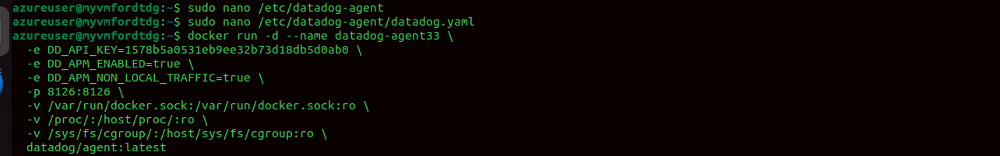

### **Sample Python App with APM**
```bash
\# app.py

from flask import Flask

from ddtrace import tracer

from ddtrace.contrib.flask import TraceMiddleware

app = Flask(\_\_name\_\_)

TraceMiddleware(app, tracer, service=\"sample-app\")

\@app.route(\'/\')

def hello():

return \"Hello from DataDog monitored app!\"

if \_\_name\_\_ == \'\_\_main\_\_\':

app.run(host=\'0.0.0.0\', port=5000)

**\# Dockerfile for Python app**

FROM python:3.9-slim

WORKDIR /app

COPY requirements.txt .

RUN pip install -r requirements.txt

COPY app.py .

EXPOSE 5000

CMD \[\"python\", \"[[app.py]{.underline}](http://app.py)\"\]
```
\# requirements.txt
```bash
Flask==2.3.3

ddtrace==1.20.0
```
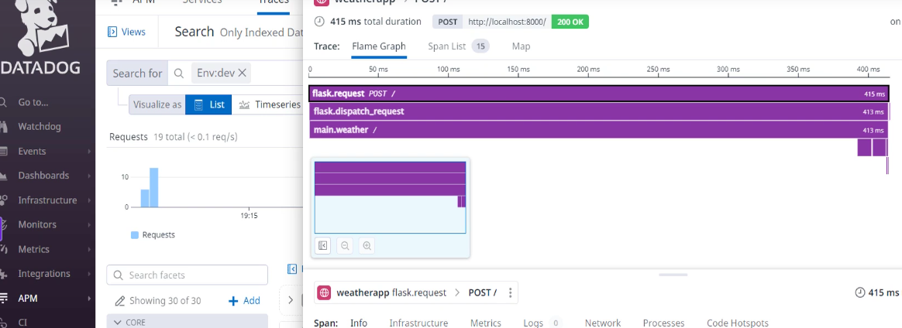

**RUM(Real User Monitoring)**

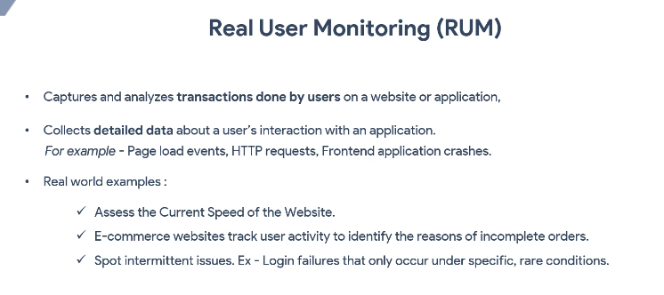

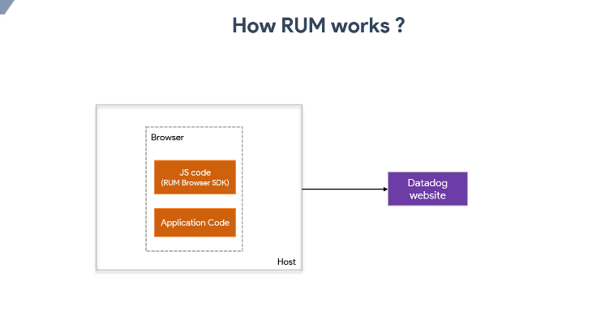

It's a feature that helps you track and analyze how actual users
interact with your web or mobile applications in **real-time**. Unlike
synthetic monitoring (which uses bots to simulate interactions), RUM
captures data from **real visitors** to your site or app.

**Event Types Collected by RUM**

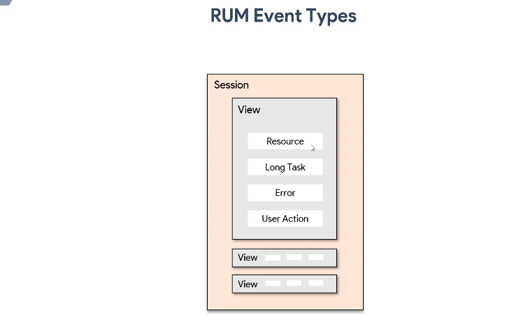

Real User Monitoring of weather app

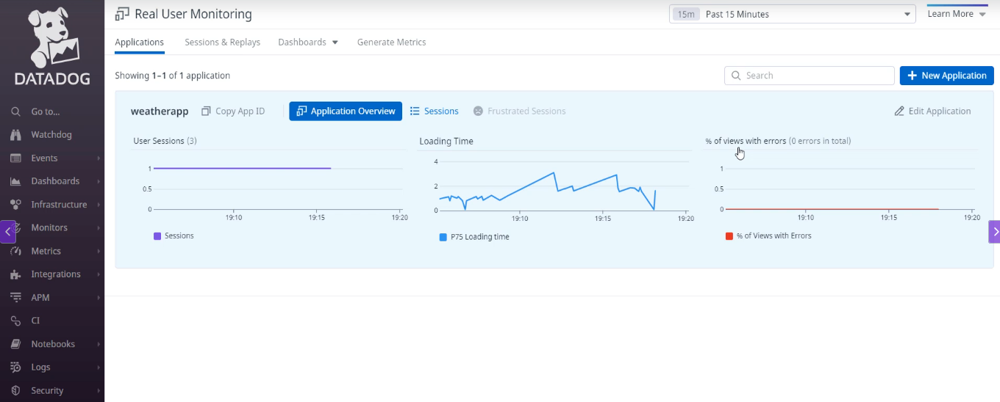

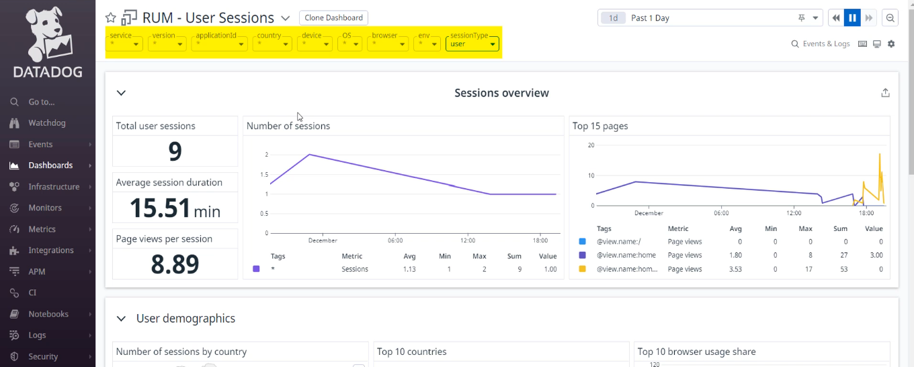
