Docker Why we need it ?

**package an application and all its dependencies** (like libraries,
frameworks, configurations, OS packages) into a **lightweight, portable
container**.

Without Docker → You install software directly on your machine. It may
break if versions mismatch (e.g., Python 3.8 vs 3.11).

With Docker → You put your app and everything it needs into a **box
(container)**, and it will run the same way anywhere---your laptop, a
server, or the cloud

\"It works on my machine\" problem is solved because containers run the
same everywhere.

Docker has two editions

Community & Enterprise

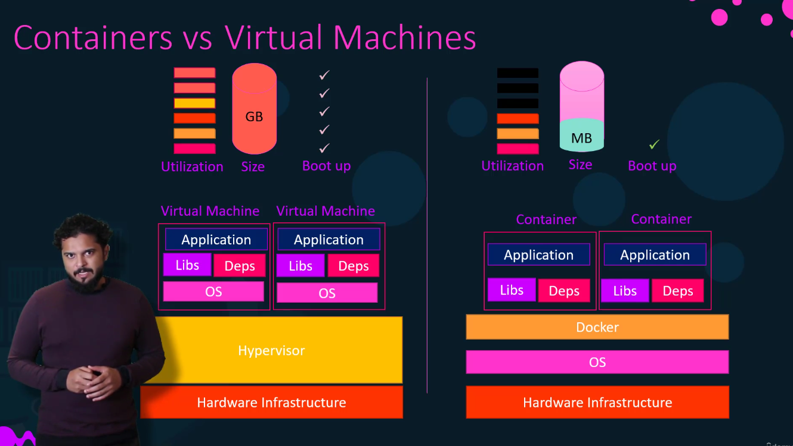 

VM: is the machine has its own os , huge sizes, slower

Containers uses OS kernel of host machine, light weight & fast.

Image: is a blue print of what we need containers contains an image it
is a subset of container

Docker Installation on Ubuntu Ec2 instance

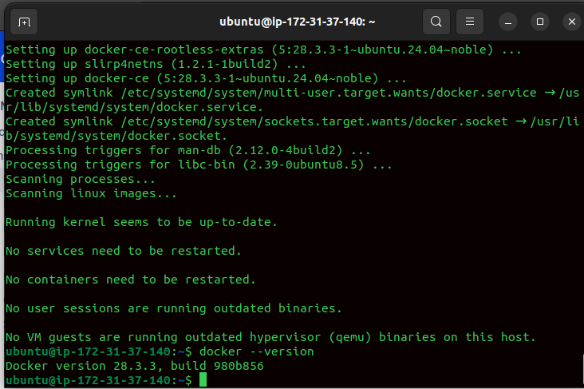

Docker Basic commands

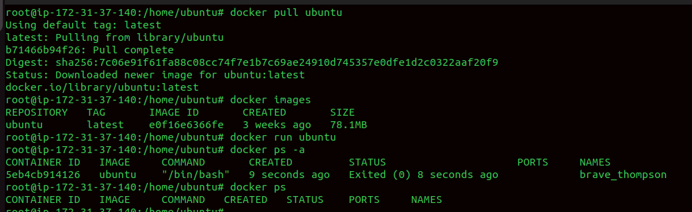

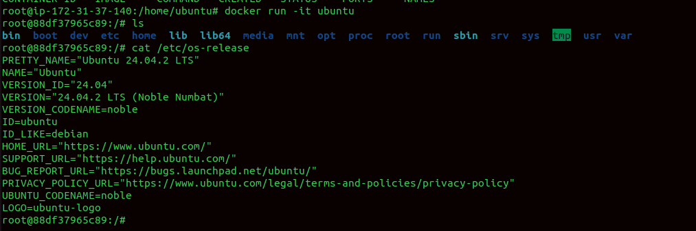

For containers

docker run hello-world \# Run a test container

docker run -it ubuntu bash \# Run container interactively with shell

docker run -d \--name web nginx \# Run container in background
(detached)

docker ps \# List running containers

docker ps -a \# List all containers (including stopped)

docker stop \<container_id\> \# Stop a running container

docker start \<container_id\> \# Start a stopped container

docker restart \<container_id\> \# Restart container

docker rm \<container_id\> \# Remove a container

docker rm -f \<container_id\> \# Force remove a container

docker logs \<container_id\> \# View container logs

docker exec -it \<container_id\> bash \# Run command inside a container

Images

docker pull nginx:latest \# Download image from Docker Hub

docker images \# List all images on your system

docker rmi nginx:latest \# Remove an image

docker rmi -f \<image_id\> \# Force remove image

## **docker image prune**

This command removes **unused Docker images** (dangling or untagged
images).

## **docker attach \<container_id\>**

-   Attaches your **terminal's STDIN/STDOUT/STDERR** to a **running
    > container**.

-   You'll see the container's live output as if you started it in
    > foreground.

-   If you type commands, they go directly into the container's running
    > process (if it accepts input).

-   

To remove all containers

Docker rm \${ docker ps -aq }

To remove all images

Docker rmi \${ docker images -q}

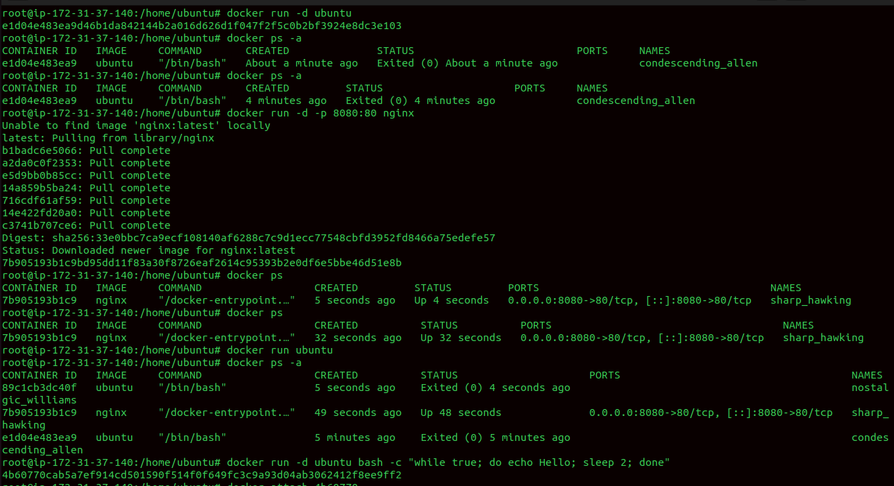

Lab

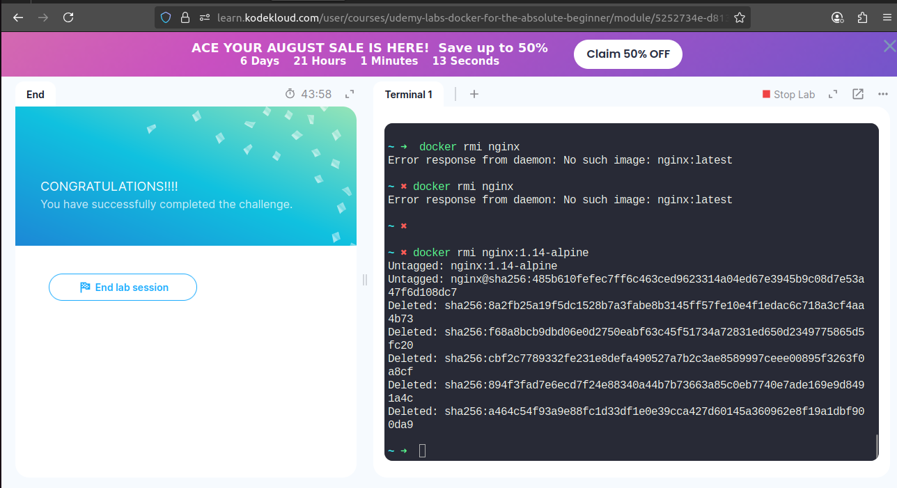

Run command

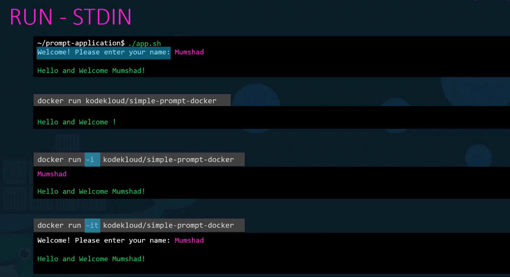

**Every docker container assigns ip by default**

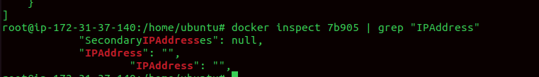

Port Mapping

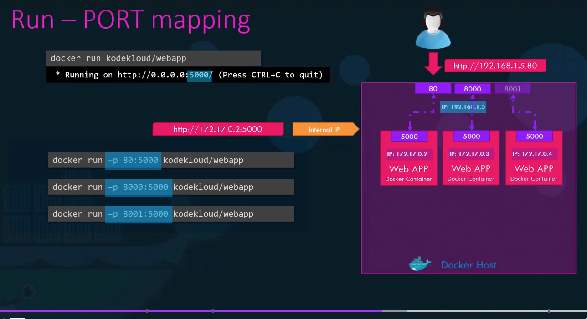

docker run -d \--name mynginx -p 8080:80 nginx

### **Breakdown:**

-   -d → Run in background (detached).

-   \--name mynginx → Name the container mynginx.

-   -p 8080:80 → Map:

    -   **Host port 8080** → **Container port 80\
        > **

-   nginx → Docker image.\
    > 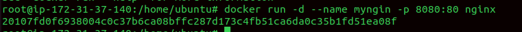

Multiple port mapping

Suppose you have a web app container that:

-   Runs a **frontend** on port 80 (inside container).

-   Runs an **API** on port 5000 (inside container).

docker run -d \--name myapp \\

-p 8080:80 \\

-p 5050:5000 \\

myapp-image

Volume Mapping

By default, when you stop or remove a container → any data inside it is
lost.

To persist data, we use **volumes** (or bind mounts) and **map them**
between host and container.

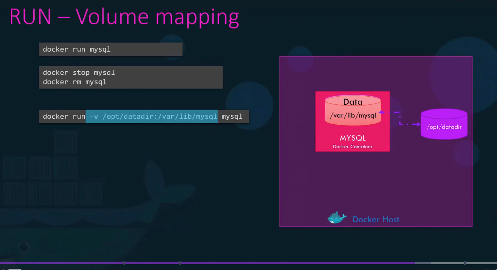

docker volume create mydata

docker run -d \--name mydb -v mydata:/var/lib/mysql mysql

A container has its **own isolated filesystem** (from the image).

-   If you don't map anything, any data written **stays inside the
    > container** → deleted when container is removed.

-   By giving a **path mapping**, you tell Docker:

docker run -d \\

-v /home/user/html:/usr/share/nginx/html \\

-p 8080:80 \\

nginx

docker volume create mydata

docker run -d \--name mydb -v mydata:/var/lib/mysql mysql

Container logs

docker logs \<container_id_or_name\>

docker logs -t \<container_id_or_name\>

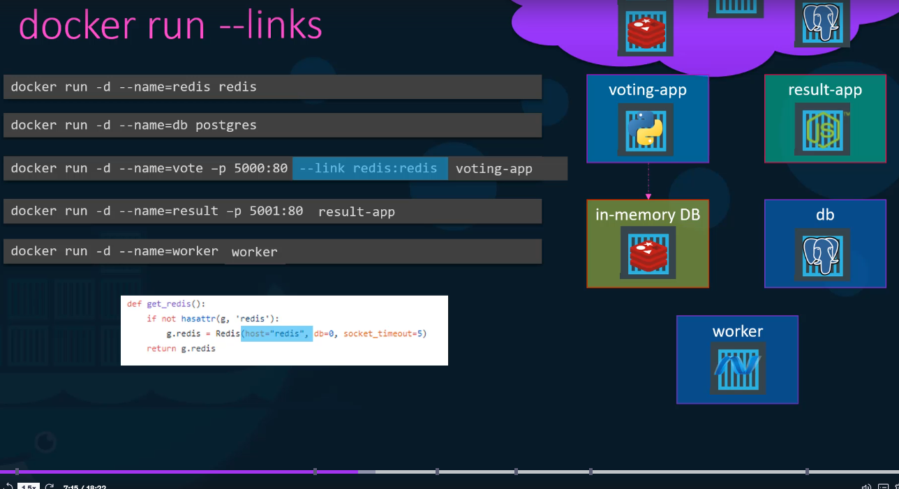

Link the containers so they can talk

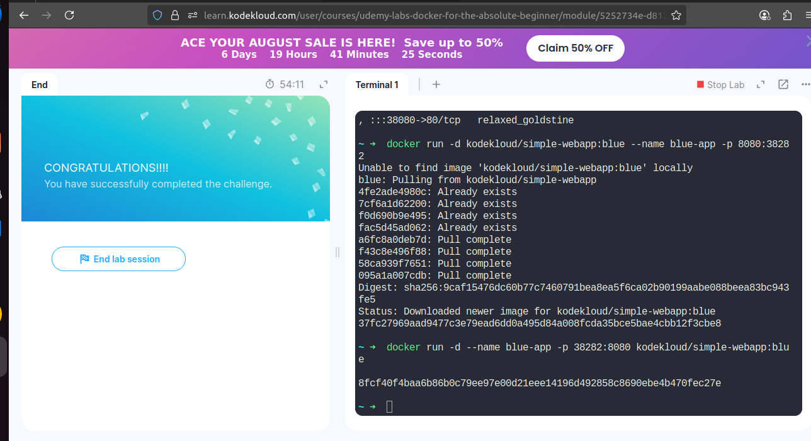

Docker Compose

**Docker Compose** is a tool to **define and run multi-container
applications**.

You write a **docker-compose.yml** file where you describe:

-   Which images/containers to run

-   What ports to map

-   Volumes (data storage)

-   Networks (how containers talk to each other)

For example compose file in yml

version: \'3\'

services:

web:

image: nginx:alpine

ports:

\- \"8080:80\"

db:

image: mysql:5.7

environment:

MYSQL_ROOT_PASSWORD: root

MYSQL_DATABASE: myapp

docker-compose up -d

Docker registry

Always log in before push ad pull form private registry

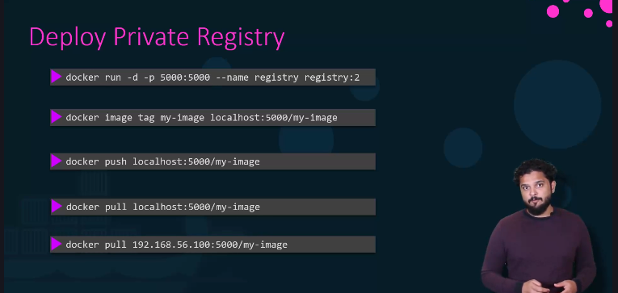

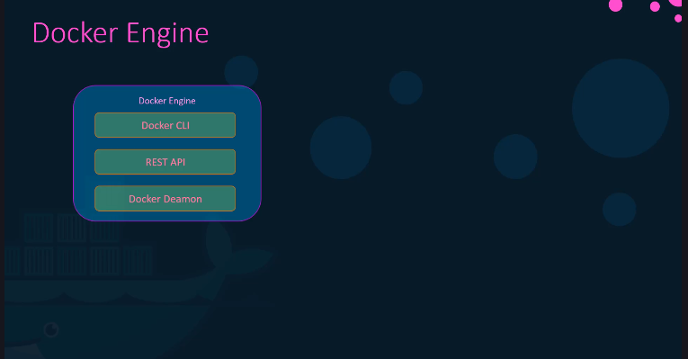

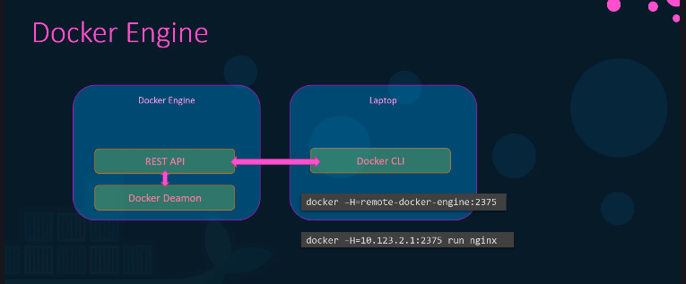

Not neccessroy on single machine

Name spaces:

Docker uses **Linux namespaces** to provide **isolation** between
containers and the host system.

Each container thinks it has its **own OS**, but actually it shares the
host kernel.

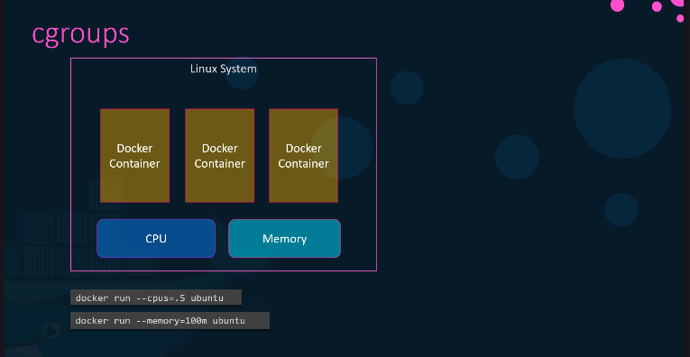

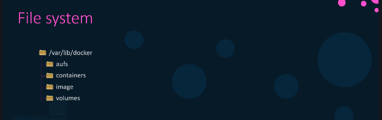

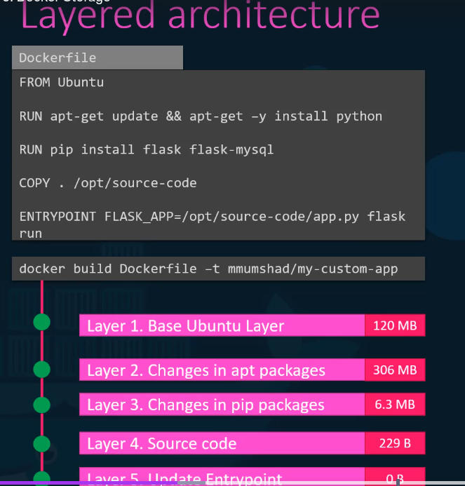

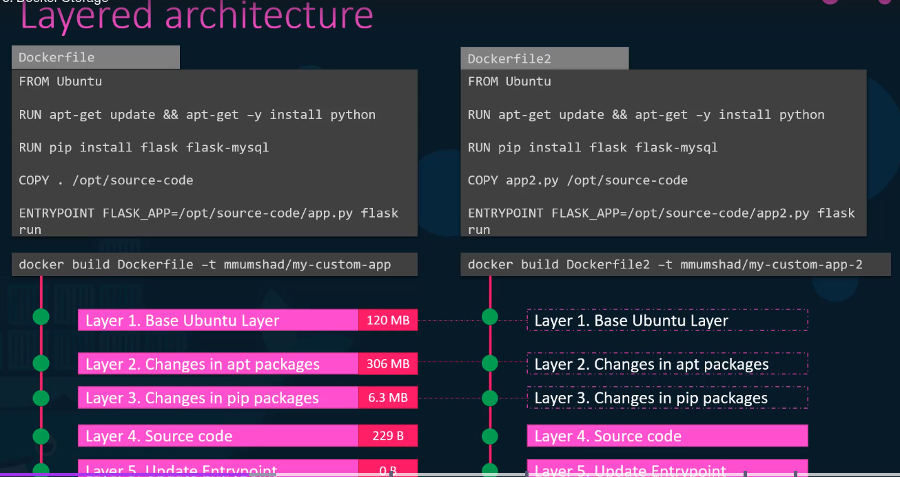

We can't modify dockerfile and image layer so we have to create new one

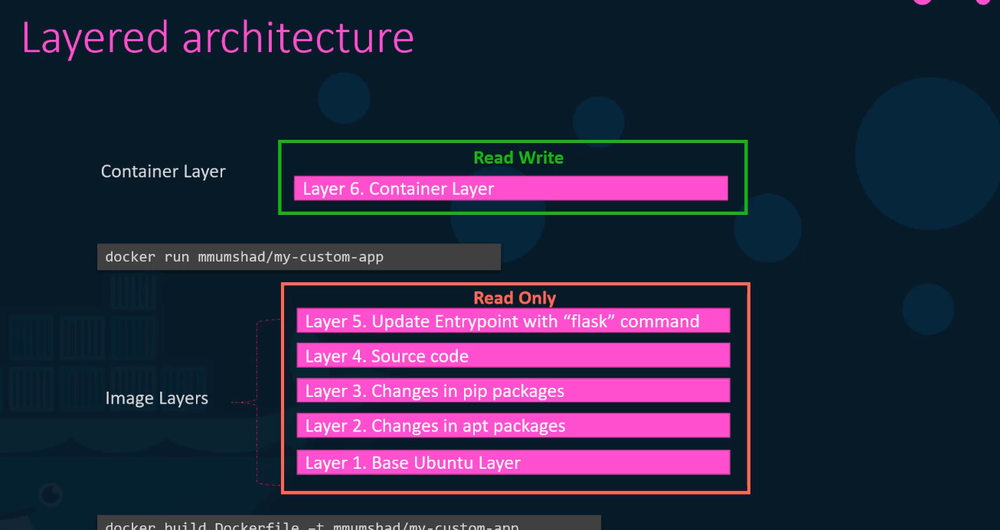

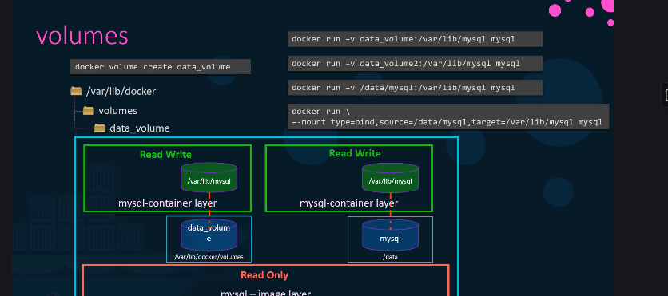

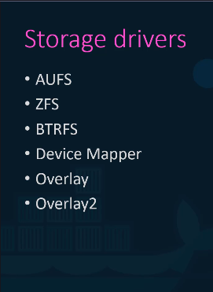
