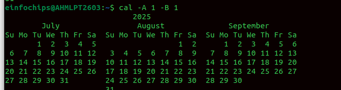
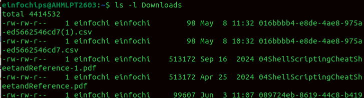
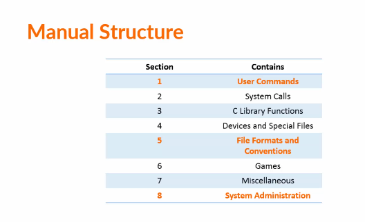
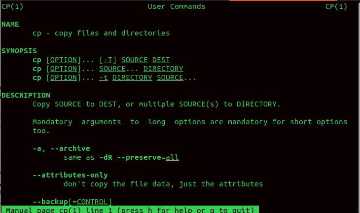
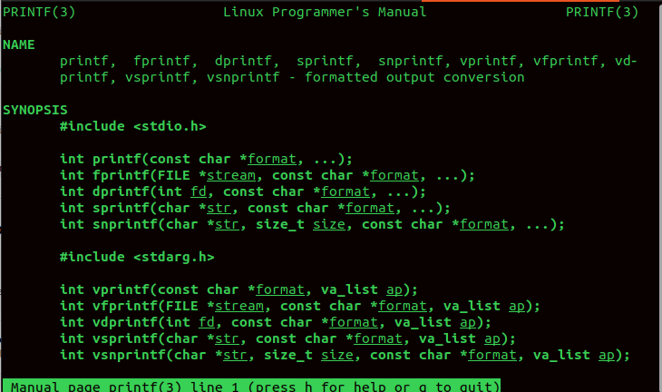
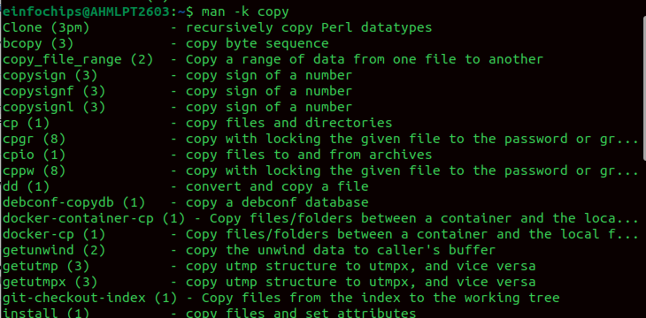
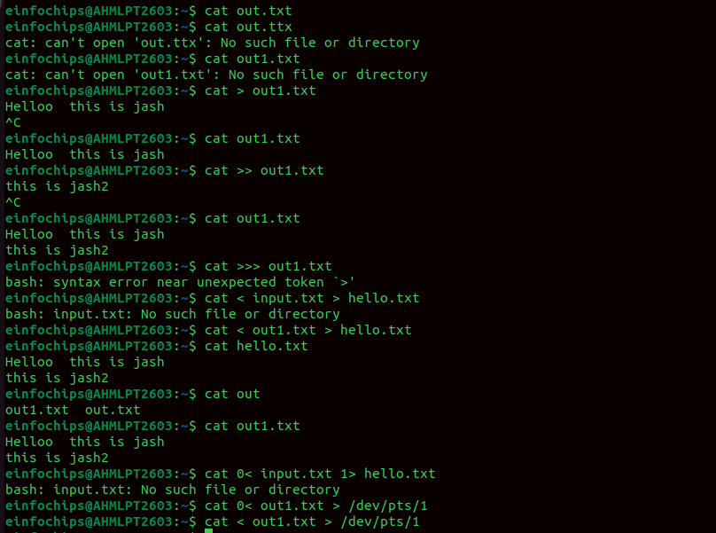
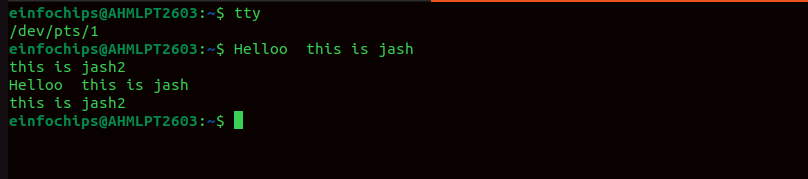

**Linux Mastery**

**History**

**! ! - last command**

**Random history**

**! 1997**

**Which ls**

Understanding the command structure

The program, builtin, function, or alias you want to run.

command \[options\] \[arguments\]

Operands: some commands needs an input which called operand

**Using the Linux Manual**

man 1 cp

Man 3 printf

Layout

**NAME** → Short description of the command

**SYNOPSIS** → How to use it (command syntax)

\[inside the square brackets\] are optional

**DESCRIPTION** → Detailed explanation of what it does

**OPTIONS** → Flags/arguments (-a, -l, etc.)

**FILES** → Related files or configs

**SEE ALSO** → Related commands or references

**EXAMPLES** → Sometimes included to show usage

The **-k option** lets you search the **man database** (like a
dictionary of manual entries) for a keyword in their short description.

man -k \<keyword\>

Command Input and Output in Linux

Every **command** in Linux works with **input** (data it receives) and
**output** (data it produces).

This is handled by the **standard streams**.

**Standard Input (stdin)** → file descriptor **0**

**Data going into a command.**

**By default: the keyboard.**

**Standard Output (stdout) → file descriptor 1\
**

-   **Normal data a command prints.\
    > **

-   **By default: the terminal screen.**

**Standard Error (stderr) → file descriptor 2**

-   **Error messages.\
    > **

-   **By default: also the terminal screen, but separate from stdout.**

{width="6.5in" height="4.833333333333333in"}

**Printing to other terminal**

{width="6.5in" height="1.4444444444444444in"}

**File redirection**

**cat**

**Why we use numbers**

**A file descriptor is just a number that the OS assigns to a file or
stream when it is opened.**

**ls \> output.txt 2\> errors.txt**

**command \> all.txt 2\>&1**

**\> all.txt → sends stdout (1) to all.txt.\
**

**2\>&1 → sends stderr (2) to the same place as stdout (1).**

**Piping**

**A pipe (\|) takes the stdout (1) of one command and passes it as stdin
(0) to another.**

**ls -l \| grep \".txt\"**

**The Tee command**

**ls -l \| tee files.txt**

**xargs builds and executes commands from stdin input.\
**

**Many commands don't read from stdin directly; xargs fixes this by
converting input into**

**ls \*.log \| xargs rm**

**find . -name \"\*.txt\" \| xargs wc -l**

**grep \"error\" logfile.txt \| tee errors.txt \| xargs -n1 echo \"Found
error in:\"**

**pipe (\|) → connect commands (stdout → stdin).\
**

**tee → split output to screen + file.\
**

**xargs → turn stdin into command arguments.**

**Alias**

**.bash_alias ---\> will be hidden file**

**It lets you create an alternative name (short form) for a command or
even a sequence of commands.**

**alias ll=\'ls -l\'**

**\
\
Use ll to use ls -l**

**Navigating to file system**
