Linux reads the labels to determine the file type

If we change .png to .jpg

Creating a file and directories

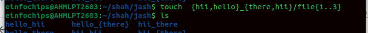

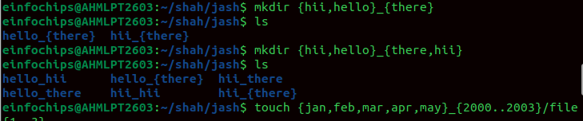

ls /Document /Download

ls \* D

ls ? txt ---\> matches exact one character

ls filename\[1234\].txt →

ls file?.txt

ls \~/\*.txt

mkdir - p shah/jash → creates parent directory too.

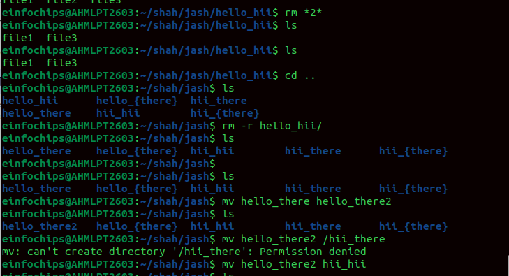

rm \*2\* ---\> remove every file has 2 in name

rm \*\[2\*3\]\*

rm -r

cp -r

If you copy a **directory**, it will copy the directory itself **and all
of its contents**, including subdirectories and their files.

Without -r, cp will not copy directories (only files).

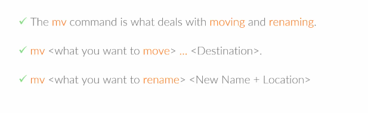

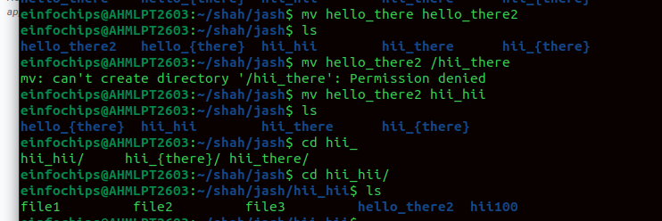

**In nano editor ctrl j to justify text**

**Locate**

Locate \* .conf

Updatedb →locate uses database to search and we should update it

**Find command**

find . -name \"file.txt\"

find . -name \"\*.txt\"

find . -type d -name \"backup\"

find /var/log -type f -name \"\*.log\"

find . -size +10M

find . -mtime -7

find . -name \"\*.log\" -exec rm {} \\;

find . -name \"\*.txt\" -exec ls -l {} \\;

find -type f -size +100k -size -1M

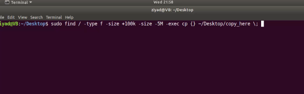
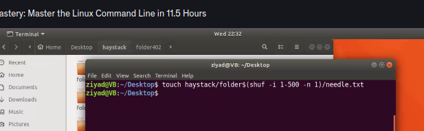

find \[path\] -maxdepth N \[conditions\]

N = 0 → only search the given directory itself (no recursion).

N = 1 → search the directory and its **immediate children**.

N = 2 → search the directory, its children, and grandchildren ... and so
on.

The -maxdepth option in the **find** command controls **how many levels
of subdirectories** find should search.

find . -maxdepth 1 -name \"\*.txt\"

**Cronjobs**

**cron** = background service that runs scheduled tasks.

**crontab** = file that stores the schedule for each user.

0 17 \* \* \* /home/user/myscript.sh

## **Logs (to check if cron is working)**

-   Cron logs are usually stored in:\
    > \
    > /var/log/syslog \# On Ubuntu/Debian

> /var/log/cron \# On CentOS/RHEL
>
> ---\-\-\-\-\-\-\-\-\-\-\-\-\-\-\-\-\-\-\-\-\-\-\-\-\-\-\-\-\-\-\-\-\-\-\-\-\-\-\-\-\-\-\-\-\-\-\-\-\-\-\-\-\-\-\-\-\-\-\-\-\-\-\-\-\-\-\-\-\-\-\-\-\-\-\-\-\-\-\-\-\-\-\-\-\-\-\-\-\-\-\-\-\-\-\-\-\-\-\-\-\-\-\-\-\-\-\-\-\--

Cat file\[1-5\].txt \> beautiful.txt

tac ---\> Stands for **"cat" in reverse**.

It **prints the lines of a file in reverse order** (last line first).

It does **not reverse the characters inside a line**.

rev ----\> Reverses **each line character by character**, but does **not
change line order**.

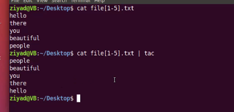{width="4.010416666666667in"
height="1.9166666666666667in"}

**GNU** = **G**NU's **N**ot **U**nix

It's a **free and open-source operating system project** started by
**Richard Stallman** in 1983 under the **Free Software Foundation
(FSF)**.

**Goal:\
**

-   To create a completely **free Unix-like operating system** (users
    > can run, study, modify, and share it).

-   Not just \"no cost,\" but **freedom**.

**GNU Components:\
**

-   GNU Compiler Collection (**GCC**)

-   GNU C Library (**glibc**)

-   GNU Bash Shell

-   GNU Core Utilities (**ls, cp, mv, rm, etc.**)

-   Many others

**Kernel part:\
**

-   Original GNU kernel is called **Hurd**, but it was never fully
    > completed.

-   Instead, GNU is usually used with the **Linux kernel**, giving us:\
    > **GNU/Linux** (commonly just called "Linux").

## **What does "compiling software from source code" mean?**

-   **Source code** = human-readable instructions written in a
    > programming language (C, C++, Java, Python, etc.). Example: .c,
    > .cpp, .java files.

-   **Compiler** = a program that translates this human-readable code
    > into **machine code** (binary 0s and 1s) that the computer can
    > actually execute.

-   **Compiling software from source code** = taking the raw source code
    > of a program and **building it yourself into an executable
    > application**.

**A software repository (repo) is a storage location where software
packages are kept.**

**Your package manager (like apt, dnf, yum, zypper, etc.) connects to
these repositories to download, install, update, and manage software.**

**Think of it like an App Store for Linux.**

**Ubuntu has main, universe, restricted, multiverse.**

**main\
**

-   **Officially supported by Canonical (the company behind Ubuntu).\
    > **

-   **Contains free and open-source software that is fully supported.\
    > **

-   **Example: bash, gcc, apt, nginx.\
    > **

**restricted\
**

-   **Proprietary drivers and software needed for hardware support.\
    > **

-   **Officially supported, but not open-source.\
    > **

-   **Example: NVIDIA/AMD drivers, Wi-Fi firmware.\
    > **

**universe\
**

-   **Community-maintained software (not officially supported by
    > Canonical).\
    > **

-   **Still free and open-source.\
    > **

-   **Example: Many open-source tools, games, and apps.\
    > **

**multiverse\
**

-   **Software that is not free/open-source (due to legal/licensing
    > issues).\
    > **

-   **Canonical does not support it.\
    > **

-   **Example: Multimedia codecs, some proprietary apps.**

**Sort**

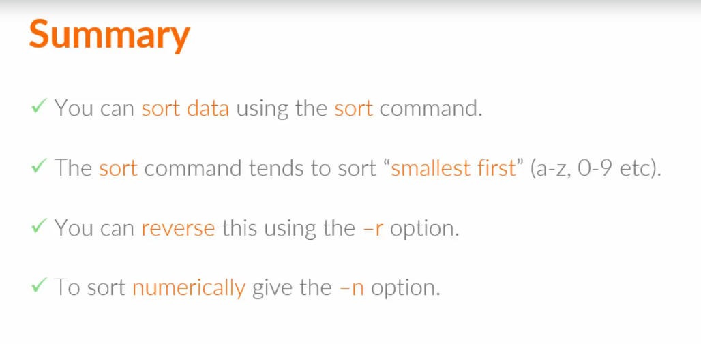
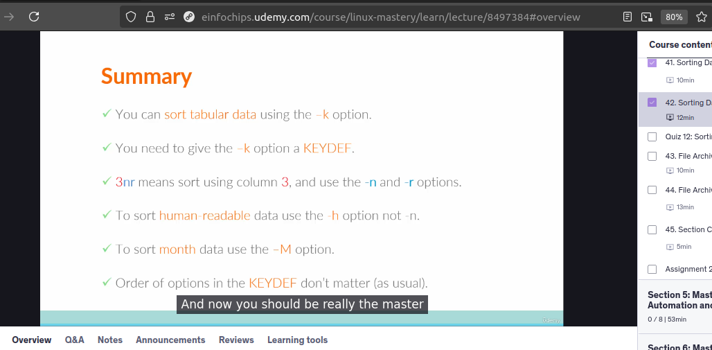
echo -e \"Line3\\nLine1\\nLine2\" \> demo_dir/file1.txt

echo -e \"10\\n2\\n5\\n1\" \> demo_dir/numbers.txt

cp -r demo_dir demo_copy

\# 2. Use tac (reverse line order)

echo \"=== tac (reverse lines) ===\"

tac demo_copy/file1.txt

\# 3. Use rev (reverse characters in each line)

echo \"=== rev (reverse characters in each line) ===\"

rev demo_copy/file1.txt

\# 4. Use sort (sort alphabetically and numerically)

echo \"=== sort (alphabetical) ===\"

sort demo_copy/file1.txt

echo \"=== sort -n (numerical) ===\"

sort -n demo_copy/numbers.txt

echo \"=== sort -nr (reverse numeric) ===\"

sort -nr demo_copy/numbers.txt

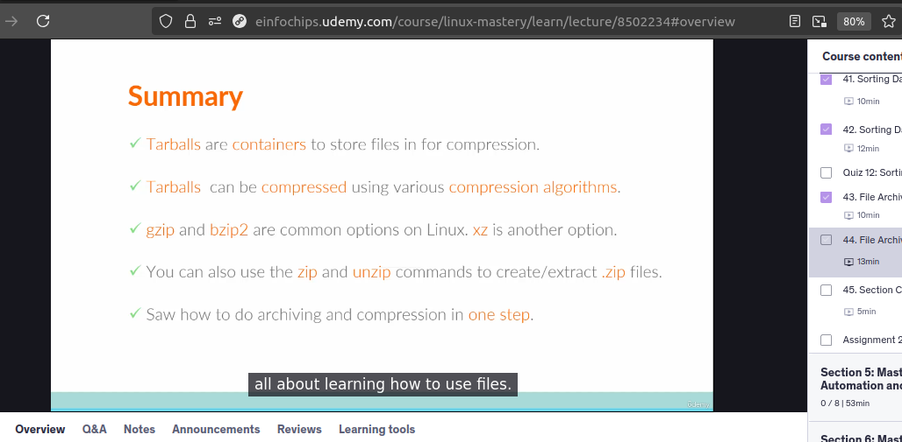

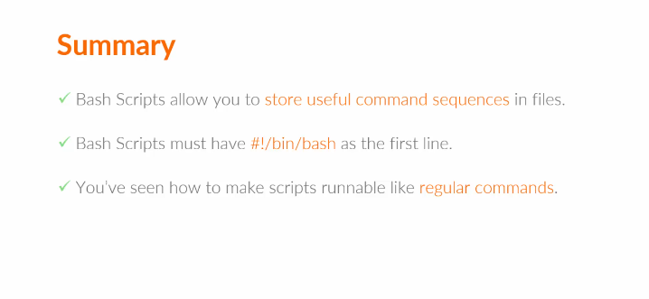

**Shell**

**Apt cache**

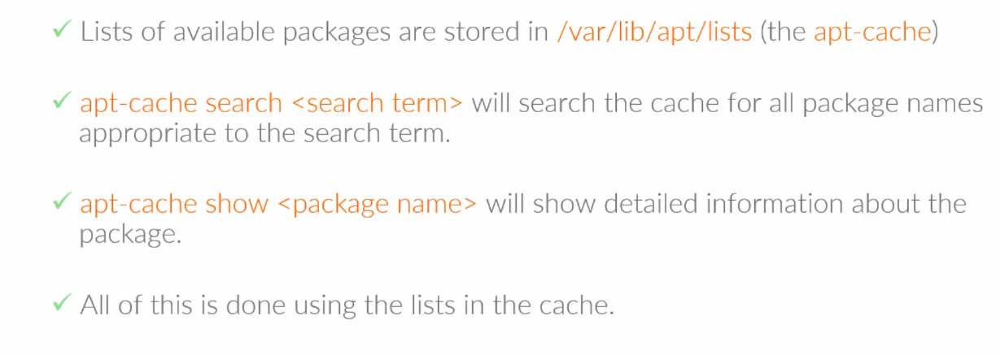

Sudo apr-get autoremove

Sudo apt-get clean

Sudo apt-get auto-clean

Sudo apt-get purge \<package_name\>

**download the source code of a package** in Linux

**Enable source repositories**

-   Open /etc/apt/sources.list

-   Make sure you have deb-src lines (they are usually commented).
    > Example:

deb-src http://archive.ubuntu.com/ubuntu jammy main restricted universe
multiverse

sudo apt-get update

apt-get source \<package-name\>
