**ITIL** = **Information Technology Infrastructure Library**

It is a **framework of best practices** for **IT Service Management
(ITSM)**.\
ITIL provides guidelines on **how organizations should design, deliver,
manage, and improve IT services** to align with business needs.

ITIL is **not a tool or software**; it's a **set of guidelines** that
organizations adopt to:

To make IT services **reliable, efficient, and cost-effective**.

To align **IT operations** with the **business goals**.

To improve **customer satisfaction** by delivering quality IT services.

Large ,medium & small organizations use ITIL in order to improve value
of services

ITIL v4 is latest version which was introduced in 2019

ITIL v4 Core Components

TIL v4 replaced the "Service Lifecycle" with the **Service Value System
(SVS)**.

The SVS shows **how all the parts of ITIL work together** to create
value for customers.

1)  Guiding Principles

> **Focus on Value** → Always deliver value to customers.
>
> **Start Where You Are** → Don't reinvent the wheel; use what you
> already have.
>
> **Progress Iteratively with Feedback** → Improve step by step, get
> feedback continuously.
>
> **Collaborate and Promote Visibility** → Work together, share
> information openly.
>
> **Think and Work Holistically** → Look at the whole system, not just
> individual parts.
>
> **Keep It Simple and Practical** → Avoid over-complicating processes.
>
> **Optimize and Automate** → Streamline work, use automation where
> possible.

2)  Governance

> Ensures that **policies and decision-making** guide IT services in
> alignment with business goals.
>
> Involves **directing, evaluating, and monitoring** the organization's
> activities.
>
> Example: A governance board decides IT priorities, such as focusing on
> cloud adoption or cybersecurity.

3\) Service Value Chain (SVC)

**core of the SVS**.\
It's a **set of interconnected activities** that organizations perform
to deliver products and services.

The 6 activities in the Service Value Chain are:

1.  **Plan** → Strategy, vision, and roadmap for IT services.

2.  **Improve** → Continuous improvement at all levels.

3.  **Engage** → Interactions with customers, stakeholders, and users.

4.  **Design & Transition** → Build and deploy new or changed services.

5.  **Obtain/Build** → Develop, acquire, or build components and
    > resources.

6.  **Deliver & Support** → Provide ongoing operations and support.

## **Practices**

In ITIL v4, **Practices** replace the old \"Processes.\"\
They are **ways of working** that combine people, processes, and
technology.

There are **34 Practices**, grouped as:

### **🔹 General Management Practices (14)**

(e.g., Continual Improvement, Risk Management, Project Management,
Architecture Management, Information Security Management).

### **🔹 Service Management Practices (17)**

(e.g., Incident Management, Problem Management, Service Desk, Service
Level Management, Change Enablement, Release Management, Service Request
Management).

### **🔹 Technical Management Practices (3)**

(e.g., Deployment Management, Infrastructure & Platform Management,
Software Development & Management).

## **Continual Improvement**

-   A central element in ITIL v4.

-   Encourages **regular evaluation and improvement** of services,
    > processes, and practices.

-   Uses a **Continual Improvement Model**:

    1.  What is the vision?

    2.  Where are we now?

    3.  Where do we want to be?

    4.  How do we get there?

    5.  Take action.

    6.  Did we get there?

    7.  How do we keep improving?

> 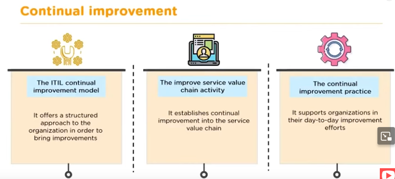

# **Summary (Easy Way to Remember)**

-   **Guiding Principles** → How to think & act (7 rules).

-   **Governance** → Who decides & ensures alignment with business.

-   **Service Value Chain** → How value is created (Plan → Improve →
    > Engage → Design & Transition → Obtain/Build → Deliver & Support).

-   **Practices** → 34 areas of expertise (like Incident Mgmt, Change
    > Mgmt, Security).

-   **Continual Improvement** → Always get better.

> Why Companies using ITIL
>
> 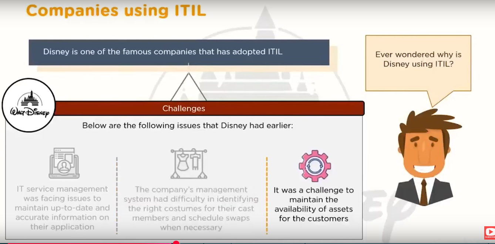
>
> Problem management in ITIL

In **ITIL**, a **problem** is:

> **The underlying cause of one or more incidents.**

-   **Incident** = effect (what user sees).

-   **Problem** = root cause (the "why" behind recurring or major
    > incidents).

**Problem Management** is the process of:

1.  **Identifying** and **analyzing** the root cause of incidents.

2.  **Finding permanent fixes** (not just temporary workarounds).

3.  **Preventing recurrence** of incidents in the future.

> **Problem Detection** → Noticed through recurring incidents, major
> incidents, or proactive monitoring.
>
> **Logging & Categorization** → Record in ITSM tool (like ServiceNow,
> JIRA, Remedy).
>
> **Root Cause Analysis (RCA)** → Use techniques like:

-   5 Whys

-   Fishbone (Ishikawa) diagram

-   Fault tree analysis

> **Workaround Creation** → Temporary fix to reduce impact until
> permanent solution is ready.
>
> **Known Error Record** → Document the problem + workaround in
> knowledge base.
>
> **Resolution & Closure** → Apply permanent fix, update records, close
> problem.
>
> 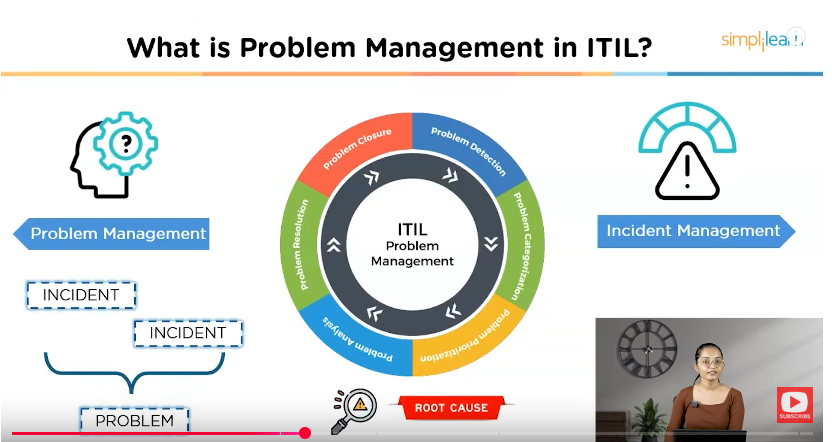
>
> 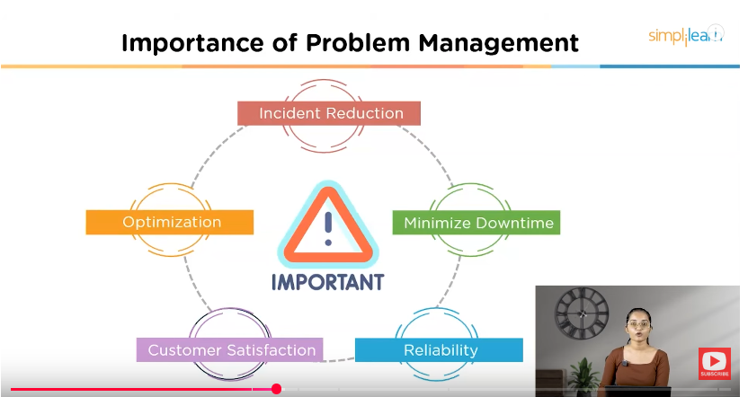
>
> 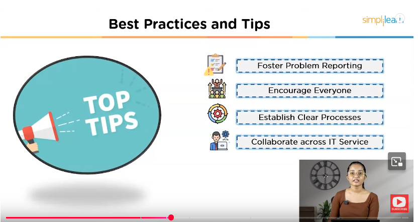
>
> **What is Incident Management**
>
> An unplanned interruption to an IT service, or a reduction in the
> quality of an IT service.
>
> Something goes wrong unexpectedly with an IT service.
>
> 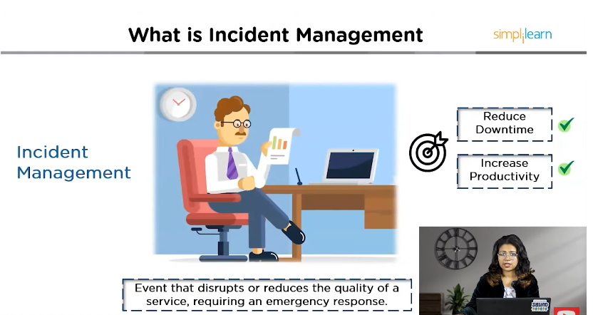
>
> 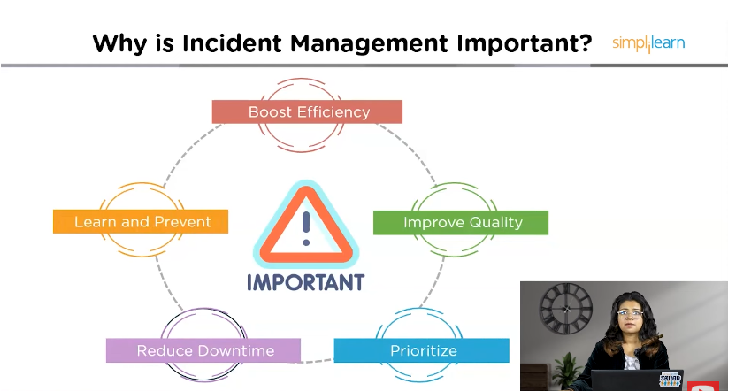
>
> 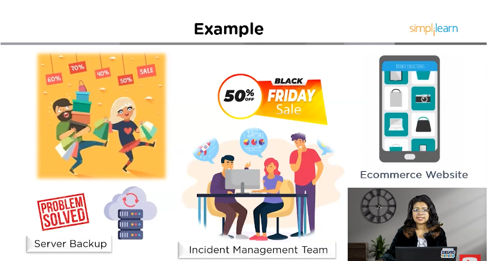
>
> 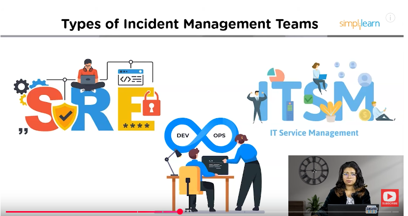
>
> 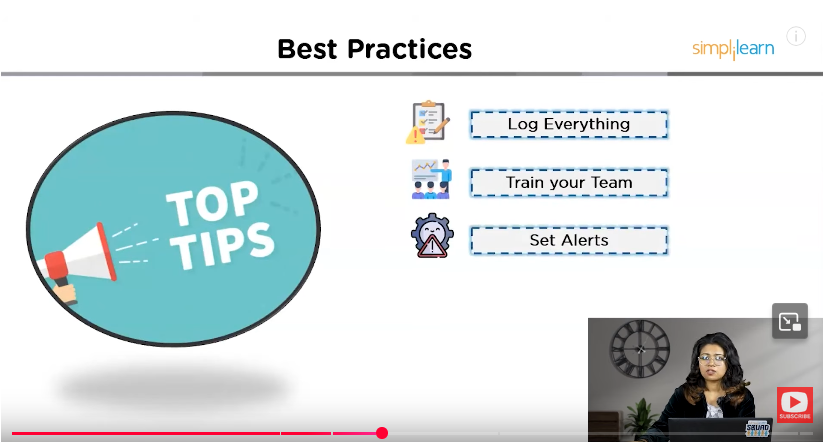

Deployment Management is responsible for moving new or changed
components to live environments

A normal change is the appropriate type for realising a new module into
the existing CRM system

Incident management system can provide the automated matching of an
incident

> **CRM (Customer Relationship Management)\
> \
> **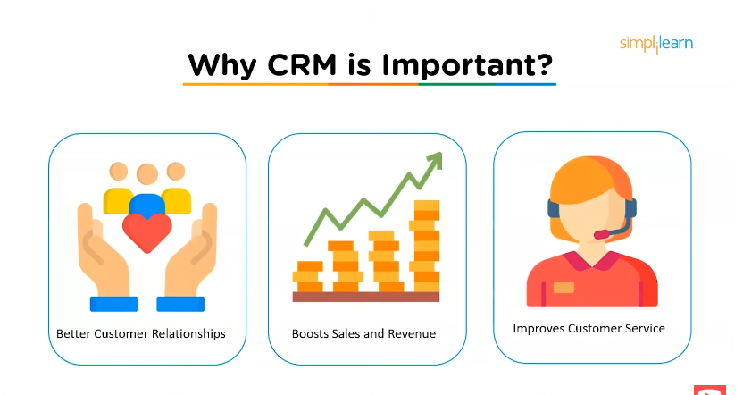
>
> 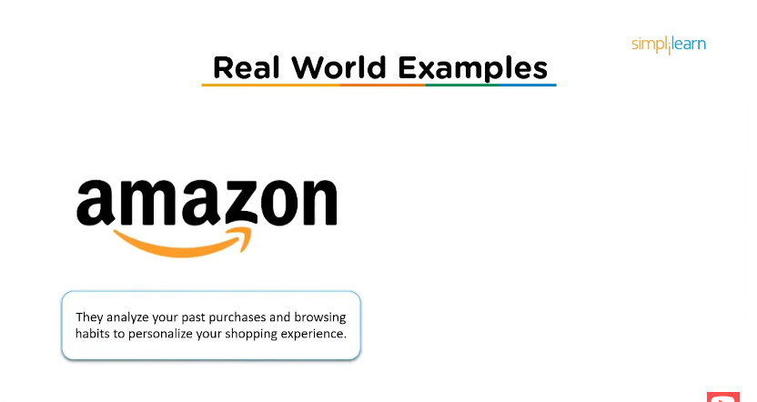
>
> A **strategy + process + technology** used by businesses to manage and
> improve interactions with customers and potential customers.

It's both a **business approach** and a **software system** that helps
companies:

-   Understand customer needs.

-   Improve relationships.

-   Increase sales and customer satisfaction.

## **Key Objectives of CRM**

1.  **Centralize customer information** (all in one place).

2.  **Track interactions** (calls, emails, meetings, complaints,
    > purchases).

3.  **Improve communication** with customers.

4.  **Boost sales & customer loyalty**.

5.  **Analyze data** to understand customer behavior and trends.

## **Types of CRM Systems**

1.  **Operational CRM** → Automates day-to-day customer-facing tasks
    > (sales, marketing, support).

2.  **Analytical CRM** → Uses customer data & analytics to improve
    > decisions.

3.  **Collaborative CRM** → Improves communication across teams (sales,
    > support, marketing).

## **Examples of CRM Software**

-   Salesforce

-   HubSpot CRM

-   Zoho CRM

-   Microsoft Dynamics 365

-   Freshsales

> In short
>
> **CRM = A system to manage customer relationships better, increase
> sales, and improve service**
