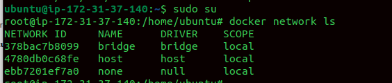
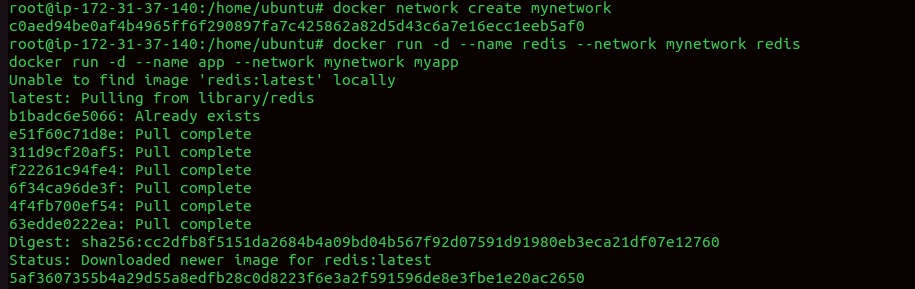
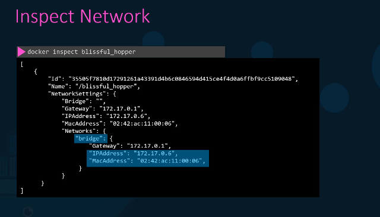
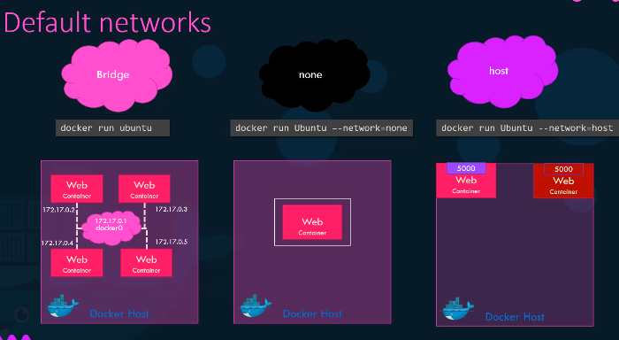

###  **Docker Networking**

Docker networking is how **containers communicate** with each other,
with the host machine, and with the outside world.

When you run containers, Docker creates **network namespaces** for them
and connects them through different types of networks.

Docker network ls

docker network create mynetwork

Inspect network using inspect

**docker run -dit \--name alpine-2 \--network none alpine**

**docker network create \\**

**\--driver bridge \\**

**\--subnet 182.18.0.0/24 \\**

**\--gateway 182.18.0.1 \\**

**wp-mysql-network**

**docker network ls**

Docker Swarm & Kubernetes are container orchestration platform

Docker Swarm:\
Small teams, simple apps.\
Quick deployment/testing.\
Low learning curve.

Kubernetes:\
Enterprise-level workloads.\
Complex microservices.\
Need for scaling, monitoring, CI/CD, multi-cloud.
