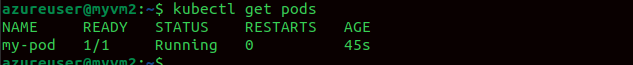
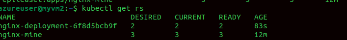

**Kubernetes (k8s)**

**Kubernetes** is an **open-source container orchestration platform**
that automates:

-   **Deployment** of applications (containers like Docker)

-   **Scaling** (adding/removing replicas automatically)

-   **Load balancing & service discovery**
    

-   **Self-healing** (restarts failed pods, reschedules on healthy nodes)

-   **Rolling updates & rollbacks**

-   **Storage orchestration**

### **Core Concepts**

-   **Pod** → Smallest deployable unit, usually runs one container.

-   **Node** → A worker machine (VM or physical server).

-   **Cluster** → A group of nodes controlled by a **control plane**.

-   **Deployment** → Defines how many replicas of a Pod you want.

-   **Service** → Exposes Pods to the network (ClusterIP, NodePort,
    > LoadBalancer).

-   **Ingress** → Routes external traffic to services using rules.

-   **ConfigMap/Secret** → Store configuration and sensitive data.

-   **Namespace** → Logical separation inside a cluster.

Using minikube
```bash
Kubectl get nodes
```


**K8s is written in YAML**

Creating first pod using yml

Pod definition file


Apply pod


```bash
Kubectl get pods
```



Other ways to create pods


Delete the pod


## **ReplicationController (RC)**

-   **One of the earliest controllers in Kubernetes**.

-   Ensures that a specified number of **Pod replicas** are always
    > running.

-   If a Pod crashes → RC creates a new one.

-   If someone manually creates an extra Pod with the same label → RC
    > kills it to maintain the desired count.

-   It is now deprecated

## **ReplicaSet (RS)**

-   **Newer and more powerful replacement for RC**.

-   Does everything RC does, but:\
    > Supports **set-based selectors** (in, notin, exists).\
    > Used by **Deployments** (whenever you create a Deployment, it
    > actually creates a ReplicaSet internally).

-   You usually **don't use ReplicaSet directly** → instead use a
    > Deployment for rolling updates, rollbacks
    command to scale (increase or decrease the replicaset)
     ```bash
    kubectl scale replicaset <replicaset-name> --replicas=2
     ```

## **template**

-   **Definition:** The template defines the **blueprint of Pods** that
    > the controller will create.

-   **Contents:** It includes:

    -   **metadata.labels** → labels assigned to the Pod.

    -   **spec** → container images, ports, environment variables, etc.

-   **Key point:** Every Pod created by the controller will follow this
    > template exactly.

## **selector**

-   **Definition:** The selector tells the controller **which Pods it should manage**.

-   **Key point:** The Pods that match the selector are the ones that count toward the replicas number.


**Important Rule:**

> The labels in the Pod template **must match** the selector. Otherwise,
> the controller won't recognize its own Pods.




**Deployment**

## **What is a Deployment?**

-   **A Deployment is a higher-level controller that manages
    ReplicaSets, which in turn manage Pods.

-   **It ensures that the desired number of Pods are running and
    > automates updates to your application.\

-   **Provides:**

    -   Rolling updates → update Pods gradually without downtime.
        

    -   **Rollbacks → revert to a previous version if something goes
        > wrong.

    -   Self-healing → restarts Pods if they crash.
       

    -   **Scaling → increase or decrease the number of replicas easily.**

## **Key Components**

1.  replicas → Number of Pods you want to run.

2.  selector → Defines which Pods belong to this Deployment.

3.  template → Blueprint for Pods (labels, containers, ports, etc.)

4.  strategy → How updates are applied (rolling or recreate)

**Why deployment \> replicasets**

**Because**

  ---------------------------------------------------------------------------
  **Deployment**   Manages ReplicaSets & Pods, provides updates, rollbacks,
                   scaling
  ---------------- ---------------------------------------------------------

  -----------------------------------------------------------------------
  **ReplicaSet**       **Ensures N Pods are running**
  -------------------- --------------------------------------------------


**Deployment -Update & Rollback**


**Option A**


**Option B**


**Apply the above deployment**

**Roll Back**


**Networking in k8s**


**What is a Service?**

A Service in Kubernetes is an abstraction that defines a logical set of
Pods and a policy to access them**.**

**Node Port**


**Cluster IP**

**Cluster ip is default service**

**Exposes the service internally only within the cluster.**

**Pods inside the cluster can communicate with it using ClusterIP or DNS
name.**


**A LoadBalancer Service is a type of Kubernetes Service that:**

1.  Exposes your Pods to external clients outside the cluster.

2.  Creates a cloud provider load balancer (AWS ELB, GCP LB, Azure LB) automatically.

3.  Forwards traffic from the LoadBalancer IP to the appropriate Pods in
    the cluster.

4.  Provides a stable external IP and abstracts the underlying Pod IPs,
    which can change


**Microservice architecture in K8s**

**Frontend + Backend**

**Backend Nodejs**
```bash
const express = require(\"express\");

const mysql = require(\"mysql\");

const app = express();

const dbHost = process.env.DB_HOST \|\| \"db-service\";

const dbUser = \"root\";

const dbPassword = process.env.DB_PASSWORD \|\| \"root123\";

const dbName = \"testdb\";

const db = mysql.createConnection({

host: dbHost,

user: dbUser,

password: dbPassword,

database: dbName

});

db.connect(err =\> {

if (err) console.log(\"DB Connection error:\", err);

else console.log(\"Connected to DB\");

});

app.get(\"/api/users\", (req, res) =\> {

db.query(\"SELECT \'John Doe\' as name\", (err, result) =\> {

if (err) res.status(500).send(err);

else res.json(result);

});

});

app.listen(5000, () =\> console.log(\"Backend listening on port
5000\"));
```
**Dockerfile**
```bash
FROM node:20

WORKDIR /app

COPY package\*.json ./

RUN npm install

COPY . .

EXPOSE 5000

CMD \[\"node\", \"[[app.js]{.underline}](http://app.js)\"\]
```


# **Frontend (Node.js + simple HTML page)**

**frontend/app.js:**
```bash
const express = require(\"express\");

const axios = require(\"axios\");

const app = express();

const BACKEND_URL = process.env.BACKEND_URL \|\|
\"http://backend-service:5000\";

app.get(\"/\", async (req, res) =\> {

try {

const response = await axios.get(\`\${BACKEND_URL}/api/users\`);

res.send(\`\<h1\>Users:\</h1\>\<pre\>\${JSON.stringify(response.data)}\</pre\>\`);

} catch (err) {

res.send(\"Error connecting to backend\");

}

});

app.listen(3000, () =\> console.log(\"Frontend listening on port
3000\"));
```
**Dockerfile**
```bash
FROM node:20

WORKDIR /app

COPY package\*.json ./

RUN npm install

COPY . .

EXPOSE 3000

CMD \[\"node\", \"[[app.js]{.underline}](http://app.js)\"\]
```


**Kubernetes YAML (k8s/microservices.yml)**
```bash
# ---------------------- Database ----------------------
apiVersion: apps/v1
kind: Deployment
metadata:
  name: db-deployment
spec:
  replicas: 1
  selector:
    matchLabels:
      app: database
  template:
    metadata:
      labels:
        app: database
    spec:
      containers:
        - name: mysql
          image: mysql:8.0
          env:
            - name: MYSQL_ROOT_PASSWORD
              value: root123
            - name: MYSQL_DATABASE
              value: testdb
          ports:
            - containerPort: 3306
---
apiVersion: v1
kind: Service
metadata:
  name: db-service
spec:
  selector:
    app: database
  ports:
    - port: 3306
      targetPort: 3306
  type: ClusterIP

# ---------------------- Backend ----------------------
---
apiVersion: apps/v1
kind: Deployment
metadata:
  name: backend-deployment
spec:
  replicas: 2
  selector:
    matchLabels:
      app: backend
  template:
    metadata:
      labels:
        app: backend
    spec:
      containers:
        - name: backend
          image: <your-dockerhub-username>/backend:latest
          ports:
            - containerPort: 5000
          env:
            - name: DB_HOST
              value: db-service
            - name: DB_PASSWORD
              value: root123
---
apiVersion: v1
kind: Service
metadata:
  name: backend-service
spec:
  selector:
    app: backend
  ports:
    - port: 5000
      targetPort: 5000
  type: ClusterIP

# ---------------------- Frontend ----------------------
---
apiVersion: apps/v1
kind: Deployment
metadata:
  name: frontend-deployment
spec:
  replicas: 2
  selector:
    matchLabels:
      app: frontend
  template:
    metadata:
      labels:
        app: frontend
    spec:
      containers:
        - name: frontend
          image: <your-dockerhub-username>/frontend:latest
          ports:
            - containerPort: 3000
          env:
            - name: BACKEND_URL
              value: http://backend-service:5000
---
apiVersion: v1
kind: Service
metadata:
  name: frontend-service
spec:
  selector:
    app: frontend
  ports:
    - port: 3000
      targetPort: 3000
      nodePort: 32000
  type: NodePort

```


**---\-\-\-\-\-\-\-\-\-\-\-\-\-\-\-\-\-\-\-\-\-\-\-\-\-\-\-\-\-\-\-\-\-\-\-\-\-\-\-\-\-\-\-\-\-\-\-\-\-\-\-\-\-\-\-\-\-\-\-\-\-\-\-\-\-\-\-\-\-\-\-\-\-\-\-\-\-\-\-\-\-\-\-\-\-\-\-\-\-\--**

**Multinode cluster using kubeadm in linux vms**


# **Install kubeadm, kubelet, kubectl on all nodes**

**sudo apt update**

**sudo apt install -y apt-transport-https ca-certificates curl**
```bash
sudo curl -fsSL https://packages.cloud.google.com/apt/doc/apt-key.gpg \|
sudo gpg \--dearmor -o
/usr/share/keyrings/kubernetes-archive-keyring.gpg

echo \"deb
\[signed-by=/usr/share/keyrings/kubernetes-archive-keyring.gpg\]
https://apt.kubernetes.io/ kubernetes-xenial main\" \| sudo tee
/etc/apt/sources.list.d/kubernetes.list

sudo apt update

sudo apt install -y kubelet kubeadm kubectl

sudo apt-mark hold kubelet kubeadm kubectl
```


# **Initialize the Master Node**

**On the master node:**
```bash
sudo kubeadm init \--pod-network-cidr=10.244.0.0/16
```
\--pod-network-cidr is needed for Flannel network plugin.

After init, you'll get a kubeadm join command for worker nodes, like

kubeadm join \<MASTER-IP\>:6443 \--token \<token\> \\

\--discovery-token-ca-cert-hash sha256:\<hash\>

# **Join Worker Nodes**

**On each worker node, run the kubeadm join command from master:**

sudo kubeadm join \<MASTER-IP\>:6443 \--token \<token\> \\

\--discovery-token-ca-cert-hash sha256:\<hash\>

# **Verify Cluster**

**On the master node:**
```bash
kubectl get nodes
```
