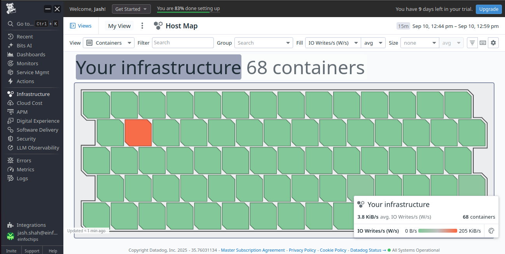
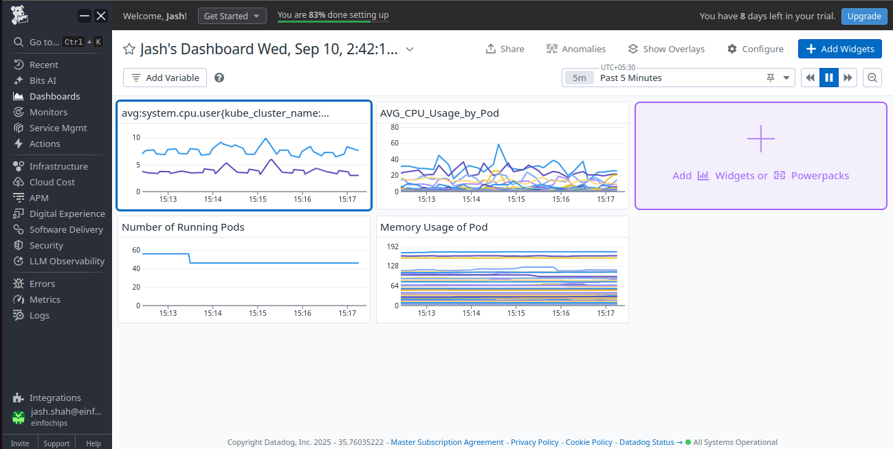

**Task: DataDog Monitoring on AKS cluster & create Dashboards & Alerts**

**Create an AKS**


**Add extension of Datadog AKS extension**


**Name it mycusterextension**

**Add your API key of datadog and Review + Create**

**Connect to that cluster**


**Run the following commands**

Install DataDog Agent via Helm

```bash
# Add DataDog Helm repository
helm repo add datadog https://helm.datadoghq.com
helm repo update
```

```bash
# Create secret with API key
kubectl create secret generic datadog-secret \
  --from-literal api-key=<YOUR_DATADOG_API_KEY> \
```
create configuration file for datadog Agent

```bash
datadog:
  apiKey: <YOUR_DATADOG_API_KEY>
  site: datadoghq.com
  
  # Enable logs collection
  logs:
    enabled: true
    containerCollectAll: true
  
  # Enable APM
  apm:
    enabled: true
    portEnabled: true
  
  # Enable process monitoring
  processAgent:
    enabled: true
    processCollection: true
  
  # Enable network monitoring
  networkMonitoring:
    enabled: true
  
  # Enable security monitoring
  securityAgent:
    runtime:
      enabled: true

# Enable cluster agent
clusterAgent:
  enabled: true
  metricsProvider:
    enabled: true
  
# Node agent configuration
agents:
  image:
    tag: "7.48.0"
  
  # Resource limits
  resources:
    requests:
      cpu: 200m
      memory: 256Mi
    limits:
      cpu: 200m
      memory: 256Mi
  
  # Enable auto-discovery
  containers:
    agent:
      env:
        - name: DD_KUBERNETES_KUBELET_HOST
          valueFrom:
            fieldRef:
              fieldPath: status.hostIP
```

Use thiscommand to deploy datadog agent

```bash
# Install DataDog agent
helm install datadog-agent datadog/datadog \
  --values datadog-values.yaml

# Verify deployment
kubectl get pods 
kubectl get daemonset -
```


```bash
kubectl get pods
```


**After agent installation**


**Sampleapp deployment**

Create and Deply sample webapp

here is the code of sampleapp.yml

```bash
apiVersion: apps/v1
kind: Deployment
metadata:
  name: sample-web-app
  labels:
    app: sample-web-app
spec:
  replicas: 3
  selector:
    matchLabels:
      app: sample-web-app
  template:
    metadata:
      labels:
        app: sample-web-app
      annotations:
        ad.datadoghq.com/sample-web-app.logs: '[{"source": "nginx", "service": "sample-web-app"}]'
        ad.datadoghq.com/sample-web-app.check_names: '["nginx"]'
        ad.datadoghq.com/sample-web-app.init_configs: '[{}]'
        ad.datadoghq.com/sample-web-app.instances: '[{"nginx_status_url": "http://%%host%%:%%port%%/nginx_status"}]'
    spec:
      containers:
      - name: sample-web-app
        image: nginx:1.21
        ports:
        - containerPort: 80
        resources:
          requests:
            cpu: 100m
            memory: 128Mi
          limits:
            cpu: 200m
            memory: 256Mi
        env:
        - name: DD_AGENT_HOST
          valueFrom:
            fieldRef:
              fieldPath: status.hostIP
        - name: DD_TRACE_AGENT_PORT
          value: "8126"
---
apiVersion: v1
kind: Service
metadata:
  name: sample-web-app-service
spec:
  selector:
    app: sample-web-app
  ports:
  - port: 80
    targetPort: 80
  type: LoadBalancer
```
apply 

```bash
kubectl apply -f sampleapp.yml
```


**Nodes**


**Containers**



**Namespaces**


**Processes**


**Sample webapp pods**


**Replicasets**


**Dashboard Created by me**



**Exported Json of my Dashboard**

```bash
{"title":"Jash's Dashboard Wed, Sep 10, 2:42:17 pm","description":"[[suggested_dashboards]]","widgets":[{"id":7472077061543233,"definition":{"title":"CPU_Usage_Nodes","title_size":"16","title_align":"left","show_legend":true,"legend_layout":"auto","legend_columns":["avg","min","max","value","sum"],"type":"timeseries","requests":[{"response_format":"timeseries","queries":[{"data_source":"metrics","name":"query1","query":"avg:system.cpu.user{kube_cluster_name:mycluster} by {host}"}],"formulas":[{"formula":"query1"}],"style":{"palette":"dog_classic","order_by":"values","line_type":"solid","line_width":"normal"},"display_type":"line"}]},"layout":{"x":0,"y":0,"width":4,"height":2}},{"id":3351575245574472,"definition":{"title":"AVG_CPU_Usage_by_Pod","title_size":"16","title_align":"left","show_legend":true,"legend_layout":"auto","legend_columns":["avg","min","max","value","sum"],"type":"timeseries","requests":[{"response_format":"timeseries","queries":[{"data_source":"metrics","name":"query1","query":"avg:kubernetes.cpu.usage.total{cluster_name:mycluster} by {pod_name}"}],"formulas":[{"formula":"query1"}],"style":{"palette":"dog_classic","order_by":"values","line_type":"solid","line_width":"normal"},"display_type":"line"}]},"layout":{"x":4,"y":0,"width":4,"height":2}},{"id":381892810748590,"definition":{"title":"Number of Running Pods","title_size":"16","title_align":"left","show_legend":true,"legend_layout":"auto","legend_columns":["avg","min","max","value","sum"],"type":"timeseries","requests":[{"formulas":[{"formula":"query1"}],"queries":[{"data_source":"metrics","name":"query1","query":"sum:kubernetes.pods.running{cluster_name:mycluster}"}],"response_format":"timeseries","style":{"palette":"dog_classic","order_by":"values","line_type":"solid","line_width":"normal"},"display_type":"line"}]},"layout":{"x":0,"y":2,"width":4,"height":2}},{"id":3514639830525069,"definition":{"title":"Memory Usage of Pod ","title_size":"16","title_align":"left","show_legend":true,"legend_layout":"auto","legend_columns":["avg","min","max","value","sum"],"type":"timeseries","requests":[{"response_format":"timeseries","queries":[{"data_source":"metrics","name":"query1","query":"avg:kubernetes.memory.usage{cluster_name:mycluster} by {pod_name}"}],"formulas":[{"formula":"query1"}],"style":{"palette":"dog_classic","order_by":"values","line_type":"solid","line_width":"normal"},"display_type":"line"}]},"layout":{"x":4,"y":2,"width":4,"height":2}}],"template_variables":[],"layout_type":"ordered","notify_list":[],"reflow_type":"fixed"}

```

queries
 
```bash
avg:kubernetes.cpu.usage.total{cluster_name:mycluster} by {pod_name}

avg:system.cpu.user{kube_cluster_name:mycluster} by {host}

sum:kubernetes.pods.running{cluster_name:mycluster}

avg:kubernetes.memory.usage{cluster_name:mycluster} by {pod_name}

```

**Created a monitor and alert for High CPU Usage**


>**Alert Notification on my email**


**Log Explorer Datadog**


